# JAIRO Cloud（WEKO3）登録ガイド　学術雑誌論文編<!-- omit from toc -->

ここでは、学術雑誌論文単体をJAIRO Cloudに登録する時の流れについて説明します。

研究データ（根拠データ）単体でJAIRO Cloudに登録する場合の流れについては、[JAIRO Cloud（WEKO3）登録ガイド　研究データ編](研究データ登録の流れ.md)をご参照ください。

JAIRO Cloudの操作に関しては、[基本マニュアル個別登録編](https://jpcoar.org/support/jairo-cloud/manual/item-registration/)もご参照ください。

また、操作に関する資料（動画等）やお問い合わせ先は[JAIRO Cloudサポートポータル](https://jpcoar.org/support/jairo-cloud/portal/)に掲載されていますので、ぜひご確認ください。

## 目次<!-- omit from toc -->

- [1 即時OAの対象となる学術雑誌論文とリポジトリ担当者の対応](#1-即時oaの対象となる学術雑誌論文とリポジトリ担当者の対応)
- [2 下準備](#2-下準備)
  - [2.1 出版社ポリシー・論文の版の確認](#21-出版社ポリシー論文の版の確認)
- [3 OA Assistを利用した場合の操作（概要）](#3-oa-assistを利用した場合の操作概要)
- [4 JAIRO Cloudから登録する操作手順](#4-jairo-cloudから登録する操作手順)
  - [4.1 概要](#41-概要)
  - [4.2 ログイン後からワークフロー開始まで](#42-ログイン後からワークフロー開始まで)
  - [4.3 Item Registration画面の概要](#43-item-registration画面の概要)
    - [4.3.1 画面全体の構成](#431-画面全体の構成)
    - [4.3.2 操作の流れ（この画面で行うこと）](#432-操作の流れこの画面で行うこと)
  - [4.4 ファイルのアップロード](#44-ファイルのアップロード)
  - [4.5 メタデータ入力画面での入力・選択](#45-メタデータ入力画面での入力選択)
    - [4.5.1 メタデータ自動入力ボタンについて](#451-メタデータ自動入力ボタンについて)
    - [4.5.2 メタデータの入力](#452-メタデータの入力)
  - [4.6 メタデータ入力画面末尾で「次へ」を選択した後の操作](#46-メタデータ入力画面末尾で次へを選択した後の操作)
    - [4.6.1 インデックスの指定](#461-インデックスの指定)
    - [4.6.2 アイテム間リンク](#462-アイテム間リンク)
    - [4.6.3 DOIの付与](#463-doiの付与)
  - [4.7 アクティビティの承認](#47-アクティビティの承認)
  - [4.8 ワークフロー完了](#48-ワークフロー完了)
  - [4.9 登録完了（様式（A）の登録見本）](#49-登録完了様式aの登録見本)
  - [4.10 ハーベスト結果の確認](#410-ハーベスト結果の確認)
- [5 GakuNin RDM-JAIRO Cloud連携を利用した場合の操作（概要）](#5-gakunin-rdm-jairo-cloud連携を利用した場合の操作概要)
- [6 補足](#6-補足)
  - [6.1 CCライセンスの付与について](#61-ccライセンスの付与について)
  - [6.2 出版社ポリシーへの対応](#62-出版社ポリシーへの対応)

## 注意：論文の根拠データの登録について<!-- omit from toc -->

論文の根拠データを含む研究データを登録する場合、以下の2パターンがあります。

- **様式（A）**：「研究データ」として、個別の１アイテムとして登録する。
- **様式（B）**：論文を公開する主アイテムの一部として、「根拠データ」のファイルを付属する形で公開する。

即時オープンアクセス義務化では「論文とその根拠データ」を原則機関リポジトリ登録することが求められていますが、最終的な掲載先であるCiNii Researchでは以下のページのとおり、**論文の根拠データは、原則、論文とは別の個別の1アイテムとして登録し、【関連情報】項での記述やアイテム間リンク等で論文と紐づける形（様式（A））にすることが推奨されています。**

[「研究データ」「根拠データ」の収録について | 学術コンテンツサービス サポート](https://support.nii.ac.jp/ja/cir/researchdata_harvest)

このマニュアルでは様式（A）に従って研究データとは別々に学術雑誌論文を登録する場合の操作の流れを説明します。

ただし、諸般の事情で「論文と根拠データを合わせた形」（様式（B））で登録することになる場合もありますので、参考に様式（B）の場合の対応も示します。

様式（B）に対応する記述は緑色の字で示します。様式（B）で登録する場合はご参照ください。

なお、根拠データ（研究データ）の登録については「[機関リポジトリへの研究データ登録ガイドライン](https://jpcoar.org/system/wp-content/uploads/2025/09/research_data_registration_guideline.pdf)」もご確認ください。

## 1 即時OAの対象となる学術雑誌論文とリポジトリ担当者の対応

- **即時OAの対象となる学術雑誌論文**  
  科研費等の、対象となる一部の競争的研究費（2025年度新規公募分以降）による研究成果のうち、電子ジャーナルに掲載された査読済みの研究論文（およびその根拠データ）※論文は著者最終稿でも可

  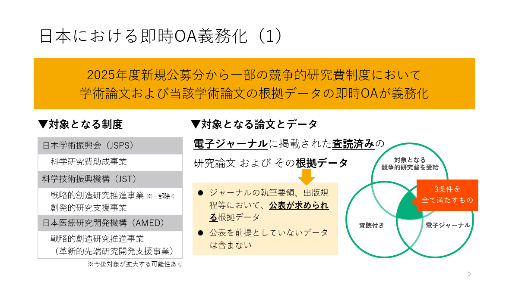

  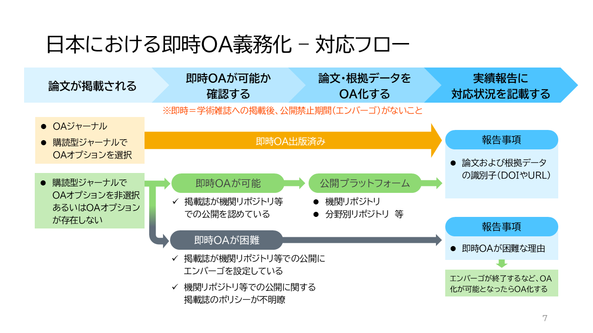

  電子ジャーナルに関する学内向け説明資料ー素材集ー【OA編】（JUSTICE,2025.3）より

- **即時OAのためリポジトリ担当者が行うこと**  
  ➀ 学術雑誌論文（+根拠データ）をオープンアクセスにする場合どうするか、（また即時オープンアクセス義務化の対象かどうか判断する際）、教員が迷わないように案内を行う。  
  ➁ 出版元でOAになっていない学術雑誌論⽂（+根拠データ）を機関リポジトリに登録する。  
  （出版元でOA済みの学術雑誌論文（＋根拠データ）を、さらに機関リポジトリへ登録することも可能）  
  ③ NII RDC上で学術雑誌論文（+根拠データ）を検索できるようにする＝IRDBにきちんとハーベストされるようにする。  

## 2 下準備

### 2.1 出版社ポリシー・論文の版の確認

1. 申請のあった論文をリポジトリに登録することに問題がないか確認する
2. 申請者から提出された論文ファイルの版（基本的にはAM（著者最終稿）かVoR（出版社版））を確認する
3. 出版社や学会のセルフアーカイブポリシーを確認する  
   [Open Policy Finder](https://openpolicyfinder.jisc.ac.uk/)（海外学術誌ポリシー確認ツール）や[SCPJ](https://jpcoar.org/support/scpj/)（国内学術誌ポリシー確認ツール）が活用できますが、出版社等のページで直接ポリシーを確認すると確実です。

詳細は以下の資料を確認してください。

[オープンアクセスと著作権 （2024年度 リポジトリ担当者の基礎知識研修（2024年度第3回JPCOAR Webinar））](https://jpcoar.org/system/wp-content/uploads/2025/07/2024_3-3_jpcoar_webinar.pdf)

[「即時オープンアクセスに備える」シリーズセミナー その1 学術雑誌論文の権利確認方法って？①よくあるパターン講義編 | オープンアクセスリポジトリ推進協会（JPCOAR）](https://jpcoar.org/members/fy2024/immediate-oa-seminar-01-1/)（JPCOAR会員機関限定・ID/パスワード認証有）

（地域ワークショップの資料（著作権ポリシー実習）を追加予定）

## 3 OA Assistを利用した場合の操作（概要）

OAアシストを利用することで、前述の対象論文の抽出、出版社ポリシーの確認、論文ファイルの提供依頼といった論文登録の下準備を効率化できます。

具体的な操作手順については、[「OAアシストを利用した登録手順」](OAアシストを利用した登録手順.md)を参照して下さい。

## 4 JAIRO Cloudから登録する操作手順

### 4.1 概要

操作は基本マニュアルの[アイテム個別登録](https://jpcoar.org/support/jairo-cloud/manual/item-registration/)で説明している内容と同じです。学術雑誌論文を登録する時に、どの項目に何を入れていくかをメインに説明します。

なお、本文中で参照・リンクしている[JPCOARスキーマのバージョンは2.0](https://schema.irdb.nii.ac.jp/ja/schema?version=257)です。バージョンにより差異が発生する可能性がありますので、ご留意ください。

登録作業は以下の流れで行います。

1. ワークフローのアクティビティを作成
2. メタデータを入力
3. アイテムにその他の情報を設定
4. リポジトリ担当者が承認
5. 登録完了
6. 登録結果の確認（JAIRO Cloud）
7. ハーベスト結果の確認（IRDB）

### 4.2 ログイン後からワークフロー開始まで

1. ログイン後、トップ画面のメニューから［ワークフロー］タブをクリックします。
  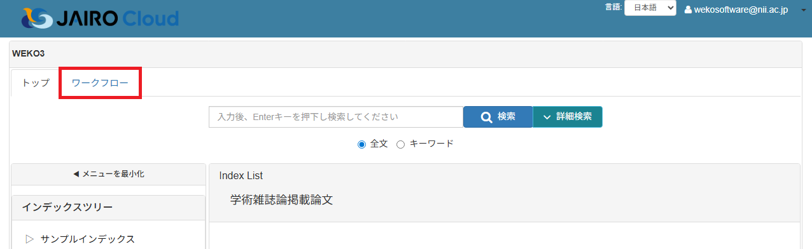
  ［アクティビティ一覧］画面が表示されます。

2. 表示された［アクティビティ一覧］画面の右下にある［+新規アクティビティ］ボタンをクリックします。
  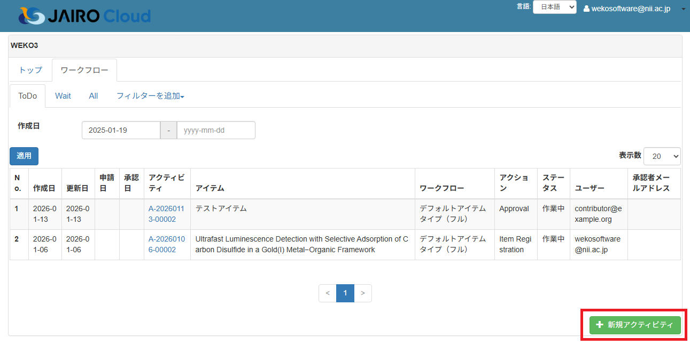
  ［ワークフロー選択］画面が表示されます。

3. 表示された［ワークフロー選択］画面のデフォルトアイテムタイプ（フル）の［+New］ボタンをクリックします。  
  ※このマニュアルの説明では、デフォルトアイテムタイプ（フル）を利用して登録します。自機関でどうしても追加したい（表示させたい）項目がない限りは、デフォルトアイテムタイプ（フル）を利用して登録することを推奨します。
  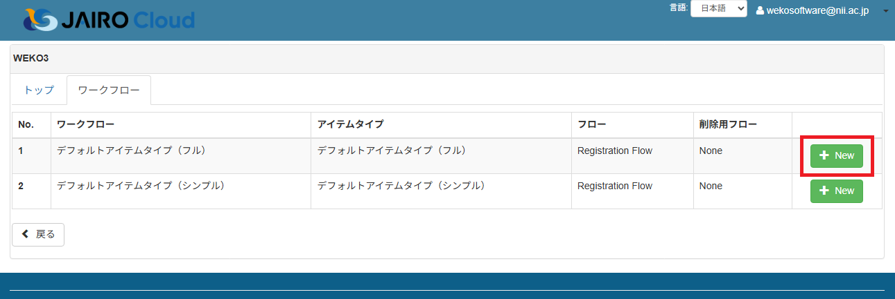
  アイテムのメタデータとコンテンツを登録する画面が表示されます。

### 4.3 Item Registration画面の概要

この画面では、ファイルのアップロードとメタデータの入力を行います。

#### 4.3.1 画面全体の構成

Item Registration画面は、主に次の項目で構成されています。

| 項番 | 項目                       | 説明                                                                                                                                                                                                |
| ---- | -------------------------- | --------------------------------------------------------------------------------------------------------------------------------------------------------------------------------------------------- |
| 1    | ファイルアップロードエリア | ファイルをドラッグアンドドロップまたは［Click to select］ボタンからファイルをアップロードします。                                                                                                   |
| 2    | メタデータ入力エリア       | 複数のパネルに分かれており、タイトル、作成者、権利情報などを入力します。 ［v］/［>］ボタンを操作することでパネルの開閉が可能です。 <b>※初期状態で展開されているパネルは入力必須項目です。</b> |
| 3    | ［削除］ボタン             | クリックすると、選択されているメールアドレスがフィードバックメール送信先から削除されます。                                                                                                          |
| 4    | ［保存］ボタン             | クリックすると、入力した内容が一時保存されます。                                                                                                                                                    |
| 5    | ［次へ］ボタン             | クリックすると、［インデックス指定］画面に遷移します。                                                                                                                                              |
| 6    | ［強制終了］ボタン         | クリックすると、入力した内容を破棄し、作業中のアクティビティを中止します。                                                                                                                          |
| 7    | ［戻る］ボタン             | クリックすると、入力した内容は保存されず［ワークフロー選択］画面に遷移します。                                                                                                                      |

#### 4.3.2 操作の流れ（この画面で行うこと）

1. ファイルアップロード
   - 論文ファイル（＋根拠データ）をアップロードします。
   - アップロード後、ファイル情報（ライセンス、アクセス権など）を入力します。

2. メタデータ入力
   - タイトル、作成者情報、権利情報、助成情報などを入力します。
   - 登録しようとしている論文のDOIやCiNii IDが分かっている場合は「メタデータ自動入力」機能を活用できます。

3. 確認と次のステップ
   - 入力が完了したら「次へ」をクリックし、インデックス指定や承認画面に進みます。

次章では、ファイルアップロードの具体的な操作を詳しく説明します。

### 4.4 ファイルのアップロード

論文ファイル（と根拠データのファイル）をアップロードします。

1. ［Drop files or folders here］に登録するファイルをドラッグ＆ドロップします。または［Click to select］ボタンをクリックすると表示される［アップロードファイル選択］ダイアログで、アップロードするファイルを選択後、［開く］ボタンをクリックします。
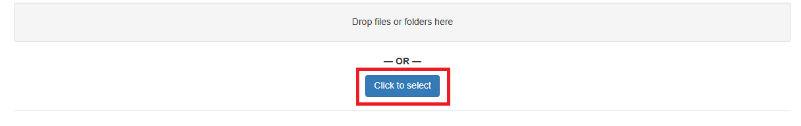
ファイル名とサイズが表示されます。
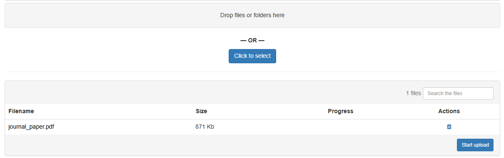

1. 表示されたファイル情報の［Start upload］ボタンをクリックします。  
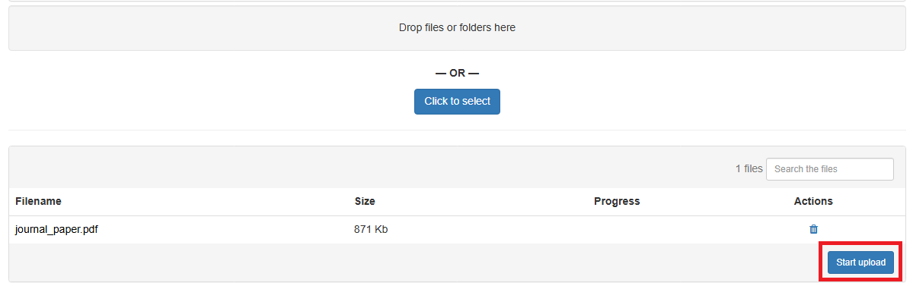
ファイルがアップロードされるとProgressに[✓]が表示されます。
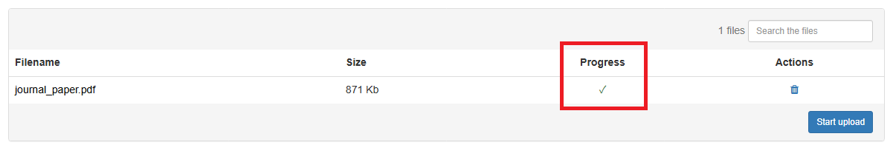

### 4.5 メタデータ入力画面での入力・選択

#### 4.5.1 メタデータ自動入力ボタンについて

DOIや各種外部サービスIDを用いて、Web APIからメタデータを取得し、自動入力することができます。  
［メタデータをAPIから取得］ボタンをクリックすると、利用するサービスを選択できます。

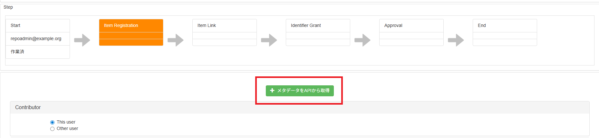

**■ 利用可能なサービスと入力項目**

| 選択肢      | 入力項目                    | 説明                                                                                                                              |
| ----------- | --------------------------- | --------------------------------------------------------------------------------------------------------------------------------- |
| CrossRef    | DOI                         | 海外雑誌論文等 ※システム管理者による Web APIアカウント設定が必要です。                                                         |
| CiNii       | CRID                        | CiNii Research収録論文                                                                                                            |
| WEKOID      | レコードID                  | 同一WEKO内の既存アイテム参照 ※レコードID：アイテム詳細画面のURLの末尾の数値部分                                                |
| researchmap | permalink, 業績種別, 業績ID | researchmapに登録されている業績情報を取得します。研究者のpermalink、業績種別、業績IDを入力してください。                          |
| DOI         | DOI                         | システム管理者によって設定された優先度順で外部Web API（例：JaLC等）へ問い合わせを行い、取得可能なメタデータを自動入力します。 |

**■ 利用例**
- 海外学術雑誌論文の場合  
  CrossRefを選択し、DOI（「10.」で始まる番号）を入力します。
  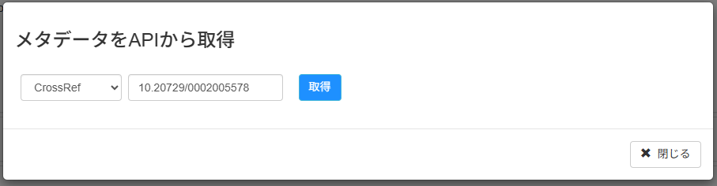

- CiNii Researchに収録されている論文の場合  
  CiNiiを選択し、CRIDを入力します。
  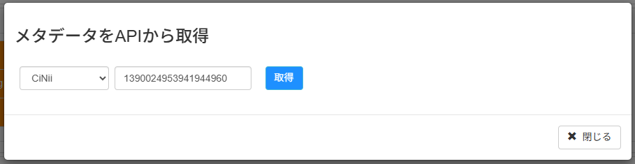

詳細は[基本マニュアル（アイテム個別登録＞メタデータ自動入力）](https://jpcoar.org/support/jairo-cloud/manual/item-registration/#metadata_auto)をご確認ください。

#### 4.5.2 メタデータの入力

黄色のハイライト部分は入力必須の項目で、その他の項目も可能な限り入力が推奨されますが、**太字**のものは特に推奨される項目です。※青字のものはJPCOARスキーマガイドラインへのリンクがあります。

- **ファイル情報**

| 項番| 項目 | 入力・選択内容 |
| --- | --- | --- |
| 1 | 【ファイル情報】  [【本文URL】](https://schema.irdb.nii.ac.jp/ja/schema/2.0/43-.1)→【オブジェクトタイプ】 | 論文：「fulltext」を選択   根拠データ：「dataset」を選択 |
| 2 | 【ファイル情報】  [【日付】](https://schema.irdb.nii.ac.jp/ja/schema/2.0/43-.4) | 個別ファイルに関連する日付はこちらに記入する。記入方法は[【日付】](#date)参照。 |
| 3 | 【ファイル情報】【表示形式】 | 「詳細表示」を選択する。 |
| 4 | 【ファイル情報】  **【ライセンス】** | 論文（＋データ）本体内の記載や著者の指定に従って、ライセンス情報がある場合は選択（もしくは自由記述）する。※詳しくは補足[「CCライセンスの付与について」](#ccライセンスの付与について)へ   特にライセンスを指定しない場合は選択しないか「自由入力（write your own licence）」を選択して何も記述せずに進める。  ※ここに入力するのはあくまでファイルのライセンス情報で、ここに入力しただけではメタデータとして流通しません。必ず 【権利情報】 にも入力します。 |
| 5 | 【ファイル情報】  **【アクセス】** | ファイル個別のアクセス権を選択する。 ・エンバーゴなし：「オープンアクセス」を選択。   ・エンバーゴあり：「オープンアクセス日を指定する」を選択。【日付】部分でも記入したエンバーゴの解禁日を再び入れる。 |

  入力例：
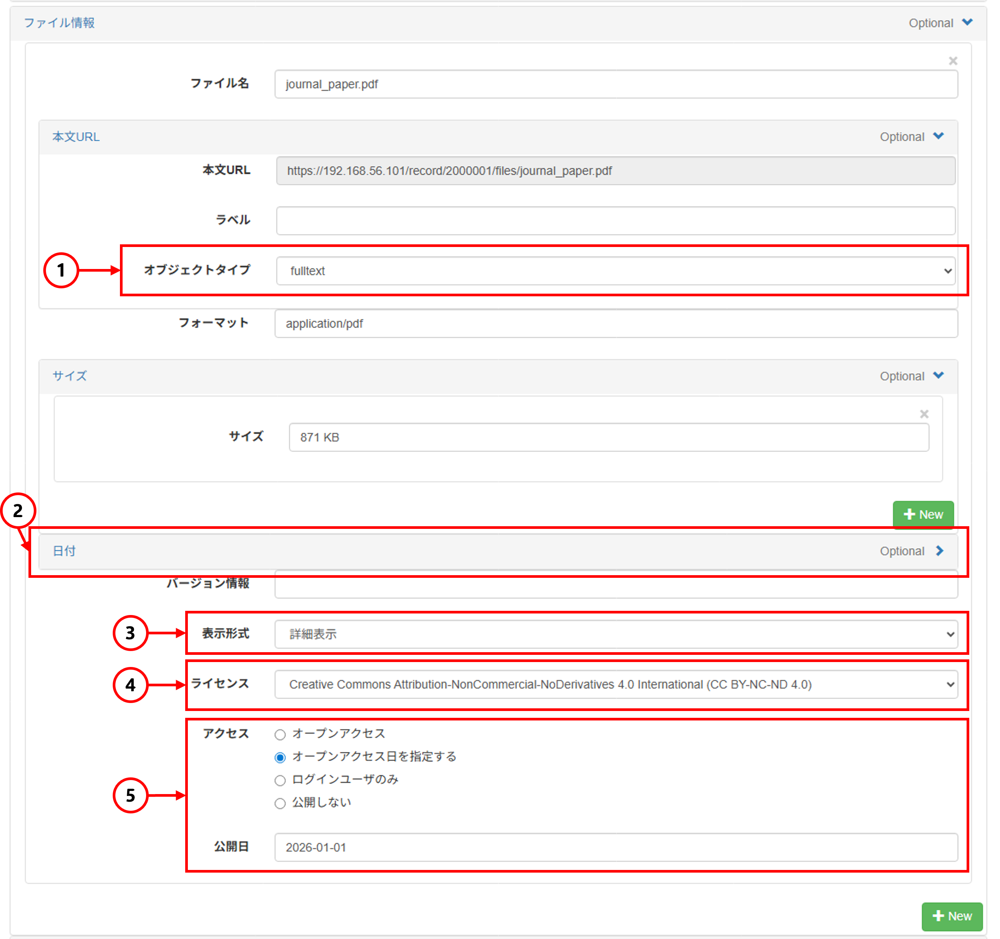

- **公開日・タイトル**

| 項番 | 項目 | 入力・選択内容 |
| --- | --- | --- |
| 1 | 【公開日】 | リポジトリに登録する日を選択する（基本的には登録作業を行っている日）。 |
| 2 | [【タイトル】](https://schema.irdb.nii.ac.jp/ja/schema/2.0/1) | 論文のタイトルと言語を入力する。 ※斜体や特殊文字も登録可能ですが、CiNiiやほかサービスに連携した際に文字化けする場合があります。 |

入力例：
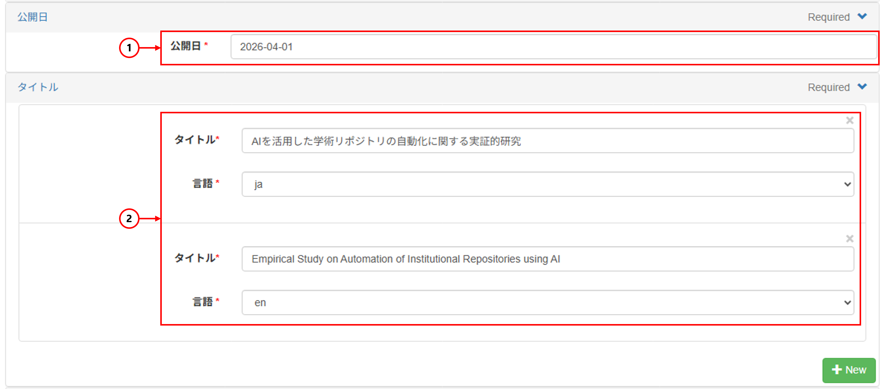

- **作成者**

| 項番 | 項目 | 入力・選択内容 |
| --- | --- | --- |
| 1 | 【作成者】  [作成者識別子](https://schema.irdb.nii.ac.jp/ja/schema/2.0/3-.1) | 「e-Rad研究者番号とORCID」を記入する。 ※e-Rad研究者番号・ORCIDは[KAKEN](https://nrid.nii.ac.jp/index/)や[researchmap](https://researchmap.jp/researchers)で確認できる。 |
| 2 | **【作成者】**  [**作成者姓名**](https://schema.irdb.nii.ac.jp/ja/schema/2.0/3-.2) | 「姓, 名」の形で入力する。 例：公開, 太郎/Koukai, Taro |
| 3 | 【作成者】  作成者所属.[所属機関識別子](https://schema.irdb.nii.ac.jp/ja/schema/2.0/3-.6-.1) | 作成者の所属機関識別子（RORが推奨される）を入力する。 ※RORは[Research Organization Registry (ROR) \| Home](https://ror.org/)の検索窓に英語で大学名を入れて検索するとヒットするURI形式（`https://ror.org/…`）のもの。 |
| 4 | 【作成者】  作成者所属.[所属機関名](https://schema.irdb.nii.ac.jp/ja/schema/2.0/3-.6-.2) | 作成者の所属機関名を入力する。 |

入力例：
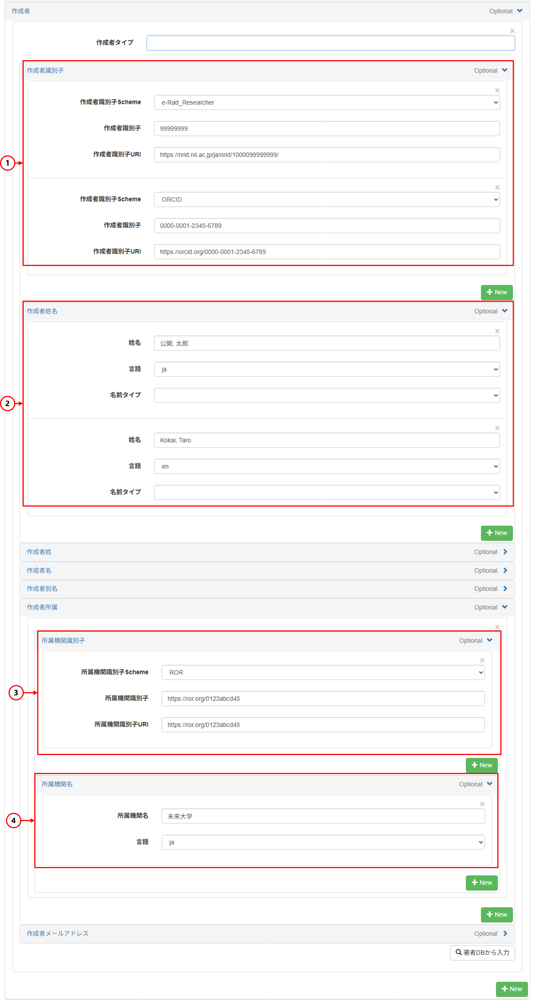

**※複数著者や作成者姓名の別名（日・英・カナ）を入力する場合の注意**  
複数の著者を登録する場合や、作成者姓名の別名（日本語／英語／カナ）を入力する場合は、「+New」ボタンを押す箇所を間違えないように注意してください。  
「+New」ボタンは入力項目ごとに複数表示されており、誤った箇所のボタンを押すと、意図しない構造のメタデータが登録される場合があります。  

下図のように、  
- ①：作成者姓名の別名を追加するための「+New」
- ②：著者（作成者）を追加するための「+New」
 
を確認し、追加したい内容に対応する番号のボタンを押してください。
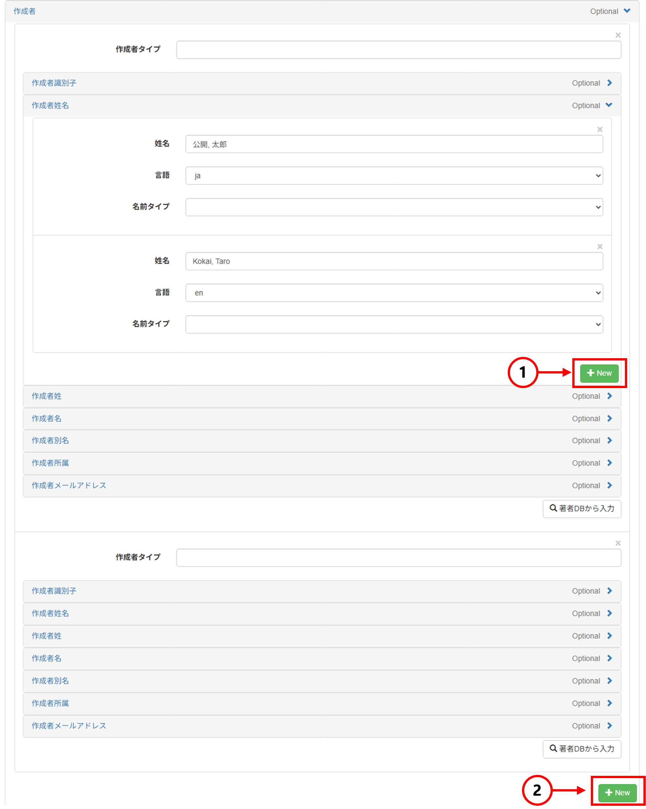

- **アクセス権・権利情報**

| 項番 | 項目 | 入力・選択内容 |
| --- | --- | --- |
| 1 | [**【アクセス権】**](https://schema.irdb.nii.ac.jp/ja/schema/2.0/5) | エンバーゴなし： 「open access」を選択。 エンバーゴあり： 「embargoed access」を選択。 ※「embargoed access」を選択した場合、エンバーゴ期間経過後「open access」に変更する。 |
| 2 | [**【権利情報】**](https://schema.irdb.nii.ac.jp/ja/schema/2.0/6) | 権利情報を入力する。 （例：©（出版社・学会名）./ This is an Open access Article under CreativeCommons Licence.） ※CCライセンスの時は補足[「CCライセンスの付与について」](#ccライセンスの付与について)を参照 根拠データについて、「データの利活用・提供方針」があればこちらに入力する。著者から事前に聞いておくとスムーズ。（例：無償。ただしクレジット表記を条件とする。）   ※研究者には[「研究データの公開・利用条件指定ガイドライン」](https://japanlinkcenter.org/rduf/doc/rduf_license_guideline.pdf)等を参考に「データの利活用・提供方針」を定めるよう周知する。 |

入力例：
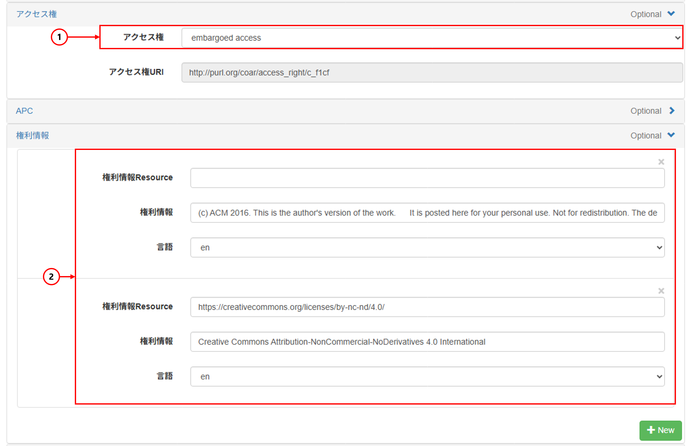

- **内容記述**

| 項番 | 項目 | 入力・選択内容 |
| --- | --- | --- |
| 1 | [**【内容記述】**](https://schema.irdb.nii.ac.jp/ja/schema/2.0/9) | 出版社ポリシーに応じて、引用文（citation）や出版社のstatementを入力する。※詳しくは補足[「出版社ポリシーへの対応」](#出版社ポリシーへの対応)へ   根拠データがある場合、データの内容に関する説明を入力する。（内容記述タイプはOtherか（技術的な情報の場合）TechnicalInfoを選択し、言語も選択する）   例：〇〇のシミュレーションにおいて〇〇の条件のもとで得られたデータ |

入力例：
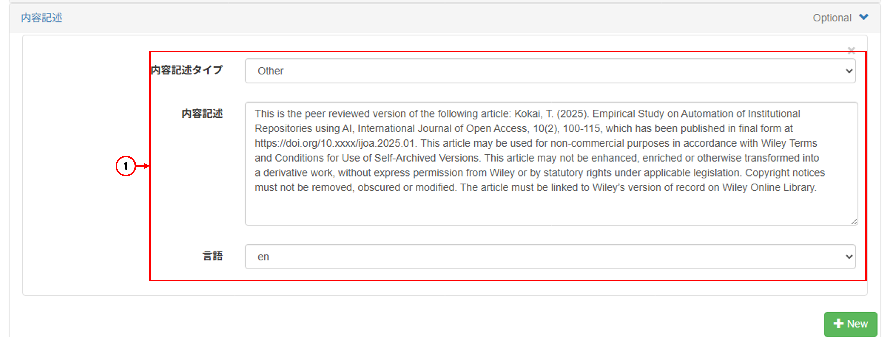

- **日付・資源タイプ**

| 項番 | 項目 | 入力・選択内容 |
| --- | --- | --- |
| 1 | [**【日付】**](https://schema.irdb.nii.ac.jp/ja/schema/2.0/12) | 日付（YYYY-MM-DD形式）を選択する。複数入力することも可能。   ・発行日がある場合は【日付】か[【書誌情報】【発行日】](#journal-date)のどちらかに必ず記入し、日付タイプは"Issued"を指定する。 ・エンバーゴがある場合は日付タイプに"Available"を指定し、エンバーゴの解禁日を必ず記入する。 |
| 2 | [【資源タイプ】](https://schema.irdb.nii.ac.jp/ja/schema/2.0/15) | 「journal article」を選択する。   ※根拠データを併せて登録する場合も同様 |

入力例：
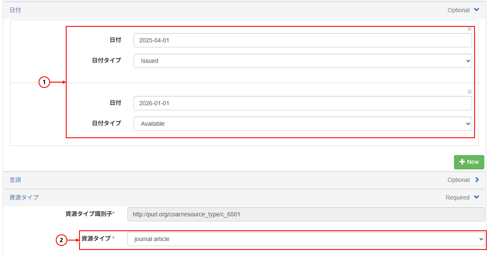

- **出版タイプ・関連情報**

| 項番 | 項目 | 入力・選択内容 |
| --- | --- | --- |
| 1 | [**【出版タイプ】**](https://schema.irdb.nii.ac.jp/ja/schema/2.0/17) | 登録する論文ファイルの版を選択肢から選択する。   基本的にはAM（著者最終稿）かVoR（出版社版） |
| 2 | 【関連情報】  [**関連識別子**](https://schema.irdb.nii.ac.jp/ja/schema/2.0/20-.1) | 出版社版のDOI（`https://doi.org/10.～`）を【関連識別子】に入れ、識別子タイプ（DOI）、関連タイプ（AMならisVersionOf、VoRならisIdenticalTo）を選択する。   根拠データと別々に登録する場合は、ここに根拠データのDOIやURIを入れ、識別子タイプ、関連タイプ（isSupplemetedBy）を入れる。 |

入力例：
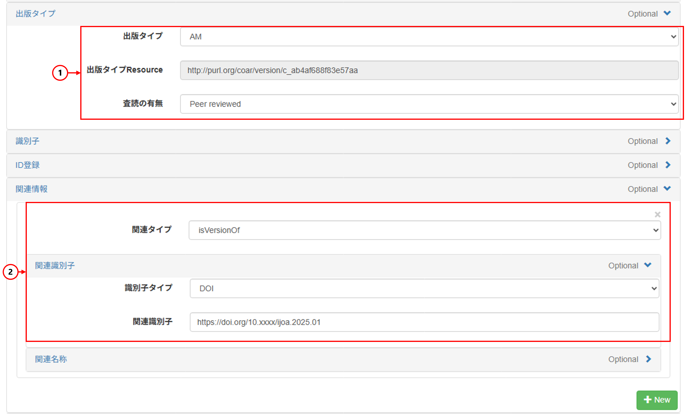

- **助成情報**

| 項番 | 項目 | 入力・選択内容 |
| --- | --- | --- |
| 1 | 【助成情報】  [助成機関識別子](https://schema.irdb.nii.ac.jp/ja/schema/2.0/23-.1). 識別子タイプ | 助成機関識別子タイプを入力する。   例：e-Rad_funder |
| 2 | 【助成情報】  [助成機関識別子](https://schema.irdb.nii.ac.jp/ja/schema/2.0/23-.1).助成機関識別子 | 助成機関識別子を入力する（以下は日本学術振興会の例）。 例：識別子：1025 　　タイプURI: https://www.e-rad.go.jp/datasets/files/haibunkikan.csv|
| 3 | 【助成情報】  [助成機関名](https://schema.irdb.nii.ac.jp/ja/schema/2.0/23-.2)[0]. 助成機関名 | 助成機関名を入力する。※言語はjaを選択   例：日本学術振興会(JSPS) |
| 4 | 【助成情報】  [助成機関名](https://schema.irdb.nii.ac.jp/ja/schema/2.0/23-.2)[1]. 助成機関名 | 助成機関名を入力する。※言語はenを選択   例：Japan Society for the Promotion of Science (JSPS) |
| 5 | 【助成情報】  [プログラム情報](https://schema.irdb.nii.ac.jp/ja/schema/2.0/23-.4) | プログラム情報を記入する。※言語はjaを選択   例：科学研究費助成事業 |
| 6 | 【助成情報】  [研究課題番号](https://schema.irdb.nii.ac.jp/ja/schema/2.0/23-.5).研究課題番号 | 研究課題番号を入力する。研究課題番号タイプは「JGN」を選択する。   例：JP25KF0049 |
| 7 | 【助成情報】  [研究課題番号](https://schema.irdb.nii.ac.jp/ja/schema/2.0/23-.5).研究課題番号URI | 研究課題番号URIを入力する。   例：`https://kaken.nii.ac.jp/grant/KAKENHI-PROJECT-25KF0049/` |
| 8 | 【助成情報】  [研究課題名](https://schema.irdb.nii.ac.jp/ja/schema/2.0/23-.6)[0].研究課題名 | 研究課題名（日本語）を入力する。※言語はjaを選択   例：電極触媒反応における多孔性配位高分子の動的化学解明 |
| 9 | 【助成情報】  [研究課題名](https://schema.irdb.nii.ac.jp/ja/schema/2.0/23-.6)[1].研究課題名 | 研究課題名（英語）を入力する。※言語はenを選択   例：Elucidating the Dynamic Chemistry of Porous Coordination Polymers in Electrocatalytic Reactions |

入力例：
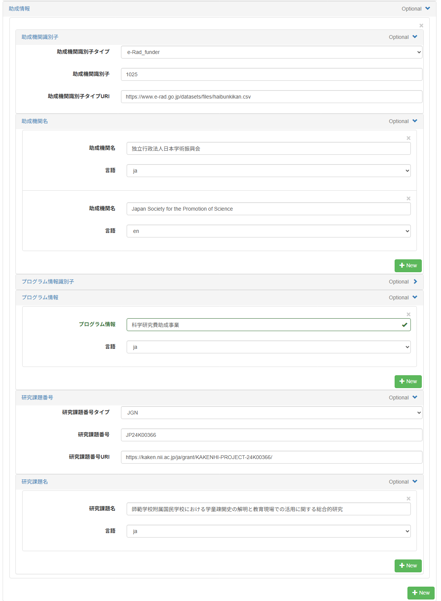

- **書誌情報**

| 項番 | 項目 | 入力・選択内容 |
| --- | --- | --- |
| 1 | 【書誌情報】 | 既に出版済みのものであれば入力する。 発行日がある場合は[【日付】](#date)か【書誌情報】【発行日】のどちらかに必ず記入し、日付タイプは"Issued"を指定する。 |

入力例：
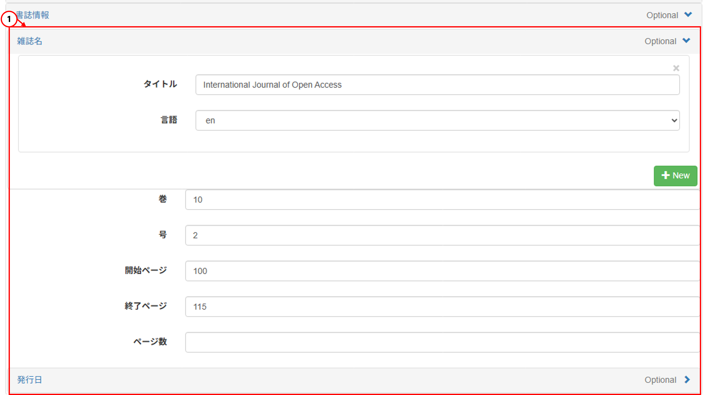

### 4.6 メタデータ入力画面末尾で「次へ」を選択した後の操作

#### 4.6.1 インデックスの指定

1. ［インデックスツリー］でアイテムを登録したいインデックスのチェックボックスにチェックを入れます。  
※ 複数インデックスに登録できるため、指定するインデックスに注意してください。

   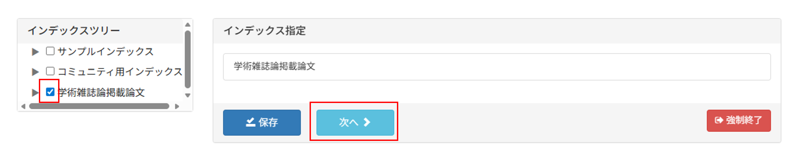
  チェックしたインデックス名が表示されます。

   ※子インデックスを選択する場合  
  「▶」をクリックして子インデックスを表示し、アイテムを登録したいインデックスのチェックボックスにチェックを入れます。
  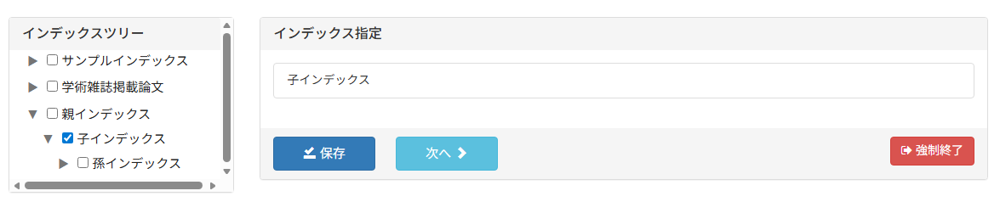

1. ［次へ］ボタンをクリックします。  
［コメント入力］画面が表示されます。  
   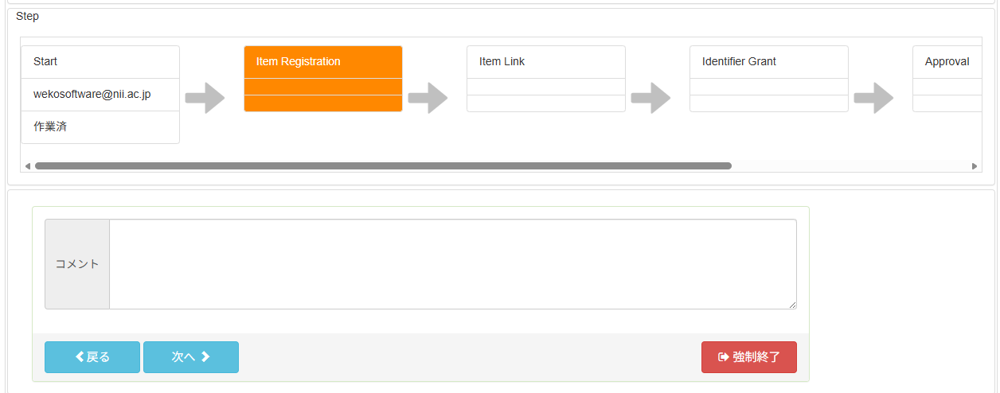

   ※下の図のように、登録作業中のコメントを入力することができます。（アイテムのメタデータには含まれず、登録作業中のみ確認することができます。）  
   必要に応じて入力してください。
   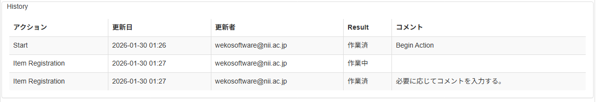

1. ［次へ］ボタンをクリックします。  
［Item Registration］アクションが完了します。

#### 4.6.2 アイテム間リンク

別に登録した研究データがある場合に、その研究データを論文に関連付けることができます。

- **注意事項**
  - **アイテム間リンクを一度作成すると削除できない不具合が発生する場合がありますので、ご注意ください。**

  - 関連付ける研究データをメタデータの登録時に【関連情報】に入力している場合は必要ありません。

  - 関連付ける研究データが複数ある場合、その研究データはすべて同じインデックスに登録されている必要があります。  
    論文と研究データは同じインデックスでも、別のインデックスでも問題ありません。  
    研究データが複数ある場合にまとめて管理できるよう、研究データ専用のインデックスを作成すると便利です。

1. ［インデックスツリー］から対象のインデックス名をクリックします。  
そのインデックスに所属するアイテムが［アイテムリンク］に表示されます。
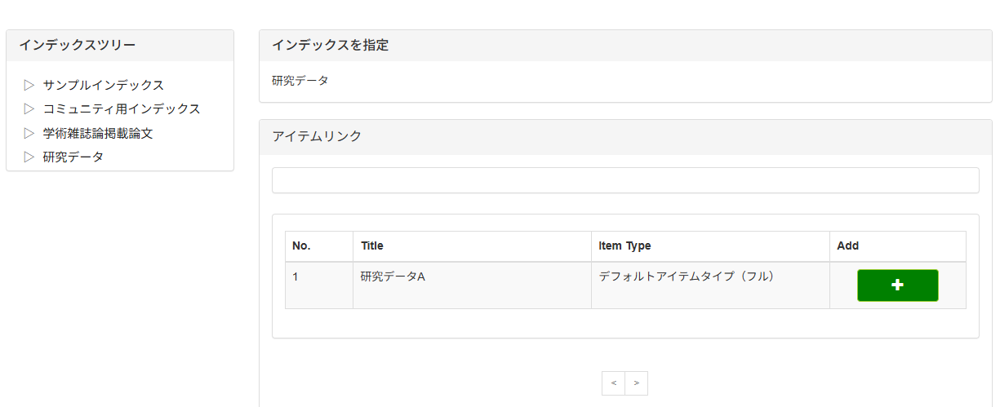

2. ［アイテムリンク］から対象アイテムの「+」ボタンをクリックします。  
［アイテムリンク］に選択したアイテムが表示されます。
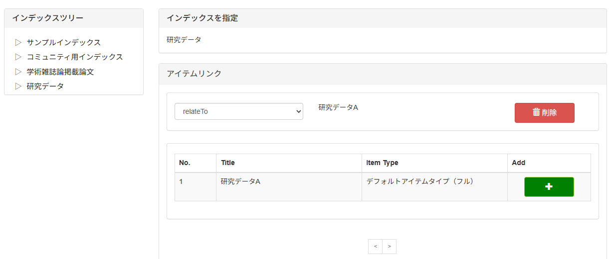

3. リレーションタイプのプルダウンから「isSupplementedBy」を選択します。
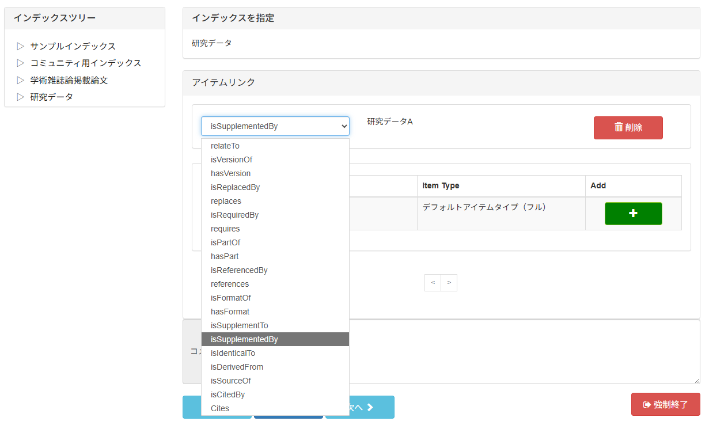

4. ［次へ］ボタンをクリックします。  
アイテム間リンクが登録されます。

#### 4.6.3 DOIの付与

自機関の識別子付与ルールに従って、JaLC DOI等のDOIを付与する機関では付与を行います。（handleなど他の識別子を利用している機関ではそちらでも可）

ただし、出版社版（VoR）の論文ファイルを登録する際に、既に他のプラットフォームでDOIが付与されている場合は、DOIを付与しないようにしてください。

識別子の付与ができたら、［次へ］ボタンをクリックします。  
［戻る］ボタンをクリックすると、アイテム間リンクの画面に戻ることができます。

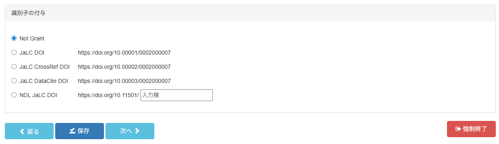

**DOI登録に関する注意事項（学術雑誌論文）**

DOIの登録には、DOI登録機関ごとに必須となるメタデータ項目があります。  
必須項目が満たされていない場合、DOI登録は行えません。  
詳細な項目や条件は、[「IRDBデータ提供機関のための DOI管理・メタデータ入力ガイドライン : JPCOARスキーマ ver2.0.x編」](https://jpcoar.repo.nii.ac.jp/records/2000282)を参照してください。

- **共通事項**
  - アイテムを登録するインデックスは公開状態であり、かつハーベスト公開が有効である必要があります。
  - 本文ファイルが登録されていないアイテムはDOI登録できません。

- **JaLC DOI**  
  以下の項目が必須です。
  - **出版者**: 不明な場合は「出版者不明」と入力してください。
  - **日付**: Issued / Created / Updated のいずれかが必須です。いずれも存在しない場合は、Issued: 9999-01-01を入力してください。
  - **開始ページ**: 不明な場合は「none」と入力してください。

- **Crossref DOI**  
  以下の項目が必須です。
  - **出版者**: 英語（en）の入力が必須です。
  - **日付**: Issued / Created / Updated のいずれかが必須です。いずれも存在しない場合は、Issued: 9999-01-01を入力してください。
  - **助成機関名**: 入力する場合は、英語（en）が必須です。
  - **収録物識別子**
  - **収録物名**: 英語（en）の入力が必須です。
  - **巻**
  - **開始ページ**: 不明な場合は「none」と入力してください。

### 4.7 アクティビティの承認

リポジトリ担当者がメタデータに不備がないか確認します。  
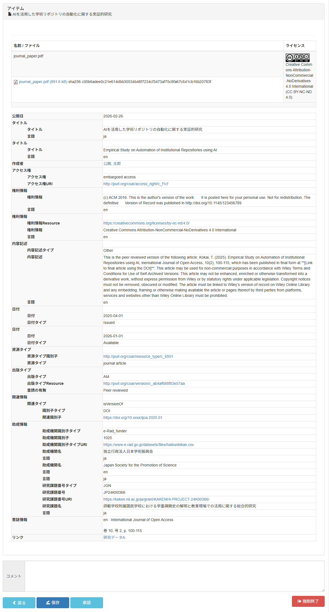

入力内容に問題がなければ［承認］ボタンをクリックします。  
不備があった場合、［戻る］ボタンを押すと識別子の付与の画面に戻ることができます。  
承認後、ワークフロー完了画面が表示されます。

### 4.8 ワークフロー完了

リポジトリ担当者により承認されるとアイテム登録が完了します。  
登録されたアイテムを確認するために［Access］ボタンをクリックします。
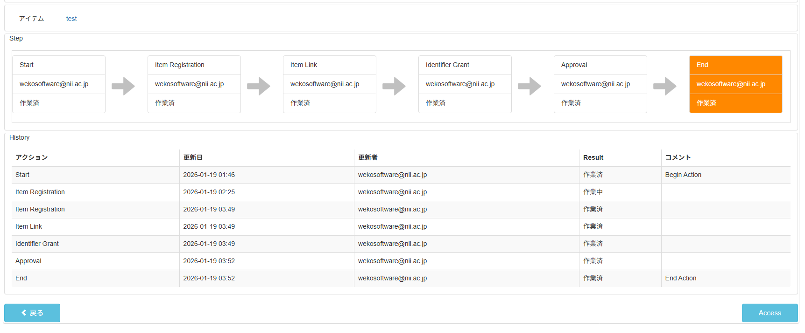
アイテム詳細画面が表示されます。

### 4.9 登録完了（様式（A）の登録見本）

登録されたアイテムの詳細ページを確認します。  
ファイルが正しく表示されているか、メタデータが正しく反映されているか、DOIや関連情報のリンクが正しく設定されているか等を確認します。
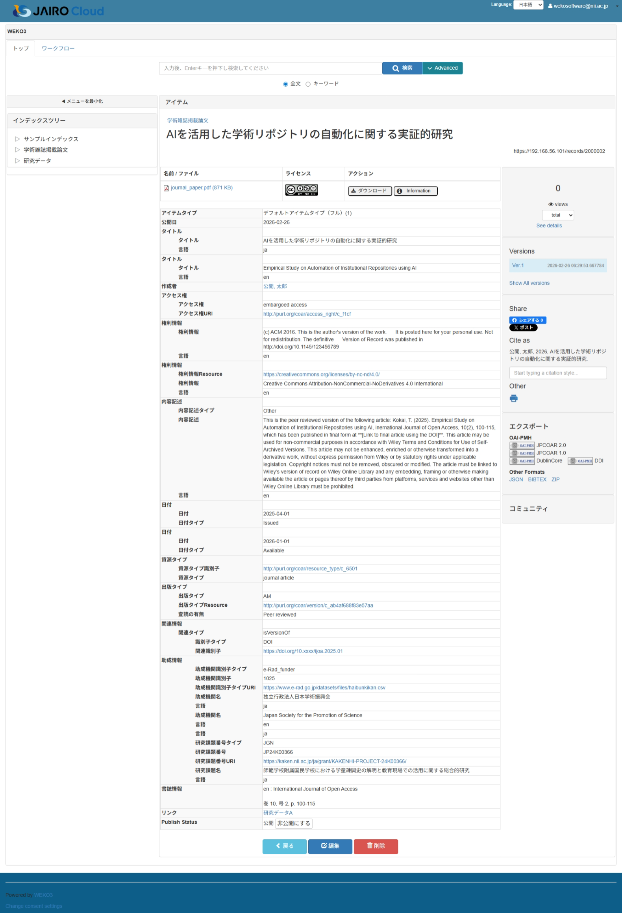

登録後にアイテムの修正が必要な場合は、［編集］ボタンをクリックすることで再編集が可能です。  
編集時の操作に関しては、[基本マニュアル個別登録編](https://jpcoar.org/support/jairo-cloud/manual/item-registration/#m4)もご参照ください。

### 4.10 ハーベスト結果の確認

IRDBによるコンテンツの収集（ハーベスト）が完了すると、登録された連絡先へ「ハーベスト処理結果通知メール」が届きます。  
メールの内容を確認し、エラーやワーニングの有無を確認して下さい。  

1. 通知メールの確認  
  メール本文に「レコードエラー件数」や「項目エラー件数」、「ワーニング件数」、「項目変換件数」が記載されています。  
  レコードエラーの内容はメール本文で、項目エラー・ワーニング・項目変換の詳細はIRDBのマイコンテンツから確認できます。  
  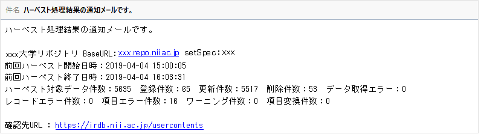  
  出典:「学術機関リポジトリデータベースサポート | マイコンテンツ・ユーザ情報」<https://support.irdb.nii.ac.jp/ja/harvest/usercontents>（参照日: 2026-01-28）

2. エラー詳細の取得と原因の特定  
  詳細な原因を確認するため、学術機関リポジトリデータベース（IRDB）にログインします。  
  マイコンテンツ画面を開き、項目エラーとワーニング、項目変換の詳細を確認します。  
  エラーメッセージの見方や修正方法については、以下の資料をご参照ください。
    - [エラーチェック解説 | 学術機関リポジトリデータベースサポート](https://support.irdb.nii.ac.jp/ja/harvest/jpcoar/validation)
    - [ハーベストエラー解消の手順（第4回学術コミュニケーションセミナー IRDB-カラクリと役割：どこから・どこへ・どのように-）](https://jpcoar.org/system/wp-content/uploads/2025/06/4-3_jpcoar_webinar_rev2.pdf)

## 5 GakuNin RDM-JAIRO Cloud連携を利用した場合の操作（概要）

GakuNin RDM–JAIRO Cloud連携を利用することで、論文ファイルおよび根拠データの登録とメタデータ入力をGakuNin RDM上で行い、その内容をJAIRO Cloudへ連携して登録できます。

本連携を利用した場合の登録の流れは、以下のとおりです。

1. GakuNin RDMで論文ファイル・根拠データを登録する
2. GakuNin RDMでメタデータを入力し、JAIRO Cloudへエクスポートする
3. JAIRO Cloudで登録アクティビティを再開し、登録を完了する

GakuNin RDMでの具体的な操作手順（画面操作や入力項目の詳細）については、[「Gakunin RDM-JAIRO Cloud連携を利用した場合の操作」](Gakunin%20RDM-JAIRO%20Cloud連携を利用した場合の操作.md)を参照してください。

JAIRO Cloud側の操作については、
本マニュアル内の[「JAIRO Cloudから登録する操作手順」](#jairo-cloudから登録する操作手順)に従ってください。

## 6 補足

### 6.1 CCライセンスの付与について

クリエイティブ・コモンズ・ライセンス（CCライセンス）は本来、著者（著作権者）の意向に従い付与するものですが、学術雑誌論文の場合には著者最終稿の登録であっても、出版社の著作権ポリシー（後述）に従って指定された種類のライセンスを付与します。また、一度付与したCCライセンスは著者であっても撤回・変更はできません。

「ファイル情報[0].ライセンス」に入力しただけでは、アイコンが表示されるだけで、メタデータとして流通しません。必ず「権利情報」にも入力します。
（参照）[権利情報 | JPCOARスキーマガイドライン](https://schema.irdb.nii.ac.jp/ja/schema/1.0.2/7)

- CC BY 4.0の場合、以下のように選択または記入する。  
  - ファイル情報[0].ライセンス：Creative Commons Attribution 4.0 International (CC BY 4.0)  
  - 権利情報[0].権利情報Resource：<https://creativecommons.org/licenses/by/4.0/>  
  - 権利情報[0].権利情報：Creative Commons Attribution 4.0 International  
  - 権利情報[0].言語：en  

  入力例：
  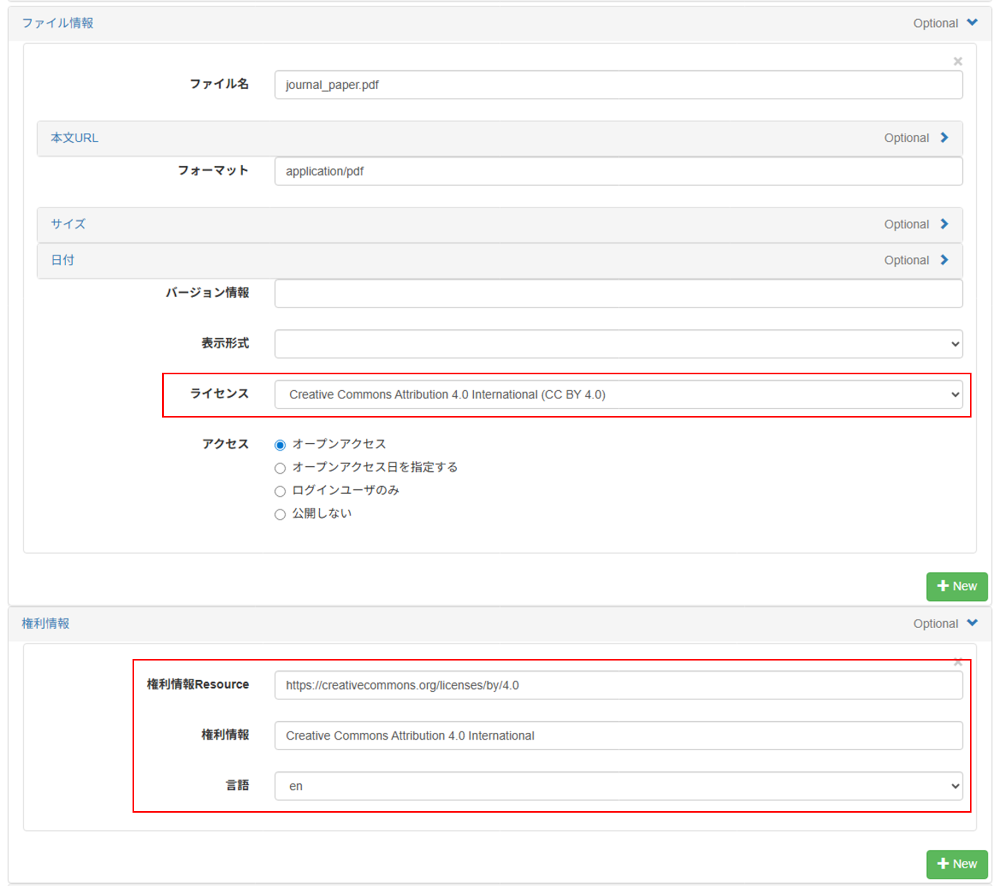

- CC BY-NC-ND 4.0の場合、以下のように選択または記入する。  
  - ファイル情報[0].ライセンス：Creative Commons Attribution-NonCommercial-NoDerivatives 4.0 International (CC BY-NC-ND 4.0)  
  - 権利情報[0].権利情報Resource：<https://creativecommons.org/licenses/by-nc-nd/4.0/>  
  - 権利情報[0].権利情報：Creative Commons Attribution-NonCommercial-NoDerivatives 4.0 International  
  - 権利情報[0].言語：en  

  入力例：
  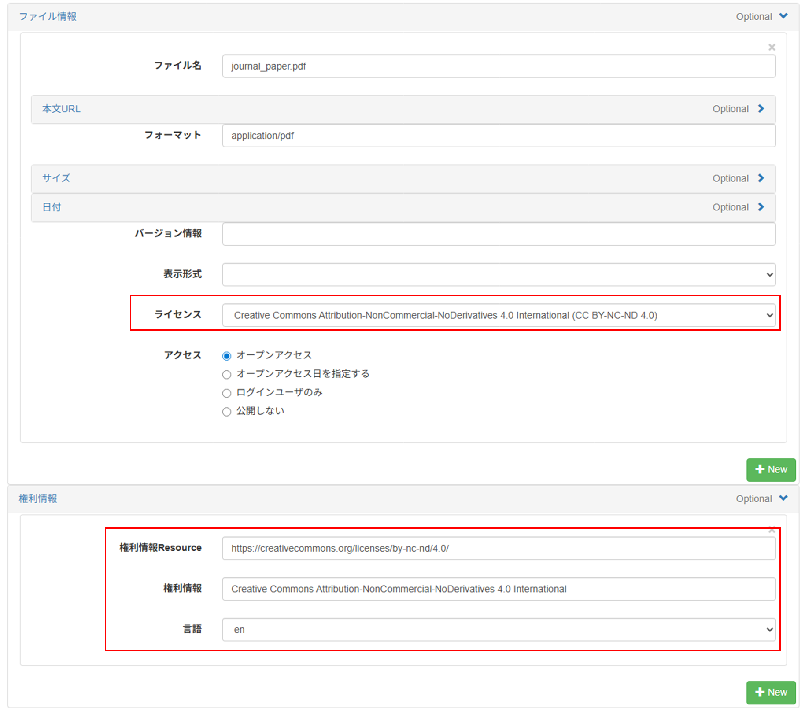

### 6.2 出版社ポリシーへの対応

Open Policy Finderや出版社ポリシーで以下のような記述があった場合のリポジトリでの記述方法です。

- Must link to publisher version with DOI  
  【関連情報】に出版社版のDOIを記入し、「isVersionOf」（AMの場合）、「isIdenticalTo」（VoRの場合）などの関連タイプを設定する。

- Published source must be acknowledged with citation  
  【内容記述】にCite情報を掲載（出版社版掲載ページで、”Cite”,”Cite this article”,”Download Citation”といったようなボタンがあるため、そこからCite情報ををコピー＆ペーストする。内容記述タイプは「Other」を設定する。）

- Set statement to accompany deposit (see policy)  
  【内容記述】に出版社のセルフアーカイブポリシー等にあるStatementをコピー＆ペーストする。内容記述タイプは「Other」を設定する。（その際DOI等はちゃんと差し替える）

  例：[Wiley](https://authorservices.wiley.com/author-resources/Journal-Authors/licensing/self-archiving.html)（AMをリポジトリに掲載する場合　※2026/01時点）

  "This is the peer reviewed version of the following article: **[FULL CITE]**, which has been published in final form at **[Link to final article using the DOI]**. This article may be used for non-commercial purposes in accordance with Wiley Terms and Conditions for Use of Self-Archived Versions. This article may not be enhanced, enriched or otherwise transformed into a derivative work, without express permission from Wiley or by statutory rights under applicable legislation. Copyright notices must not be removed, obscured or modified. The article must be linked to Wiley’s version of record on Wiley Online Library and any embedding, framing or otherwise making available the article or pages thereof by third parties from platforms, services and websites other than Wiley Online Library must be prohibited."
