# OA Assistを利用した場合の操作

## 概要

OA Assistは、機関に所属する研究者の学術雑誌論文情報を、Lens や J-STAGE などの外部データベースから収集し、一覧・管理できる機能です。

OA Assistを利用することで、以下の作業を一連の流れとして行うことができます。

- 機関に関係する論文の把握・抽出
- 出版社ポリシーや査読の有無等の確認
- 著者への本文提供依頼
- JAIRO Cloudへの論文情報の連携
- 連携後の登録状況の管理

これにより、学術雑誌論文を機関リポジトリに登録する際に必要となる事前確認や連絡作業を効率化することができます。

## 本マニュアルの位置づけ

本マニュアルは、[「学術雑誌論文登録の流れ」](journalPaperdeposit.md)で示した全体像のうち、OA Assistを利用して論文情報を確認し、JAIRO Cloudに連携・登録するまでの操作手順に特化して説明するものです。

出版社ポリシーや論文の版の考え方、即時オープンアクセス（以下、即時OA）への対応方針など、登録にあたっての前提知識については、以下の資料をご参照ください。

- [学術雑誌論文登録の流れ | 即時OAの対象となる学術雑誌論文と機関リポジトリ担当者の対応](journalPaperdeposit.md#即時oaの対象となる学術雑誌論文と機関リポジトリ担当者の対応)

本手順は、即時OAの対象論文に限らず、機関リポジトリへの登録可否を検討する学術雑誌論文全般において利用することができます。

なお、OA Assistの機能全般や画面構成の詳細については、以下のマニュアルもあわせてご参照ください。

- [OA Assistユーザーマニュアル（準備中）]()

## 下準備

ここではOA AssistからJAIRO Cloudにアイテムを送信するにあたり、必要なJAIRO CloudとOA Assistの設定手順を説明します。

### アプリケーション設定

1. 必要な情報の準備
   - **OA AssistのコールバックURL**: 機関設定画面で表示されるコールバックURLを取得します。
     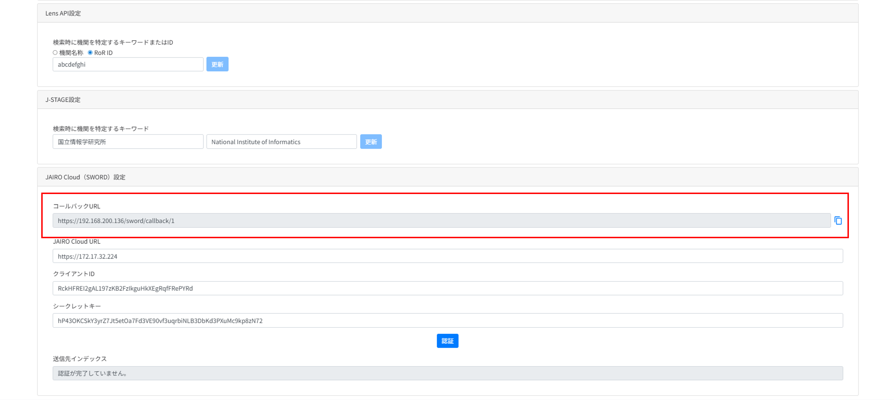

2. JAIRO Cloudでのアプリケーション設定
   1. JAIRO Cloudに管理者ユーザーでログインします。
   2. 右上のプルダウンメニューから「アプリケーション」を選択します。  
        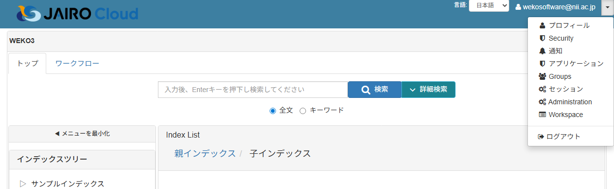
   3. 「Developer Applications」の「New Application」を選択します。  
        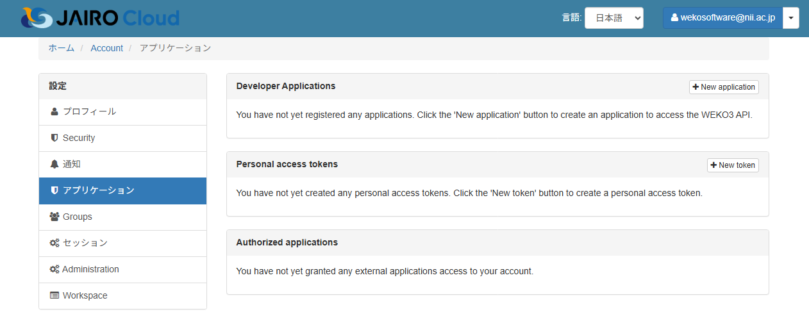
   4. 以下の情報を入力します：
      - **名前**: 任意のアプリケーション名を入力します。
      - **ウェブサイトURL**: OA AssistのURLを入力します。
      - **Redirect URIs**: OA AssistのコールバックURLを入力します。
      - **Client type**: 「Confidential」を選択します。
        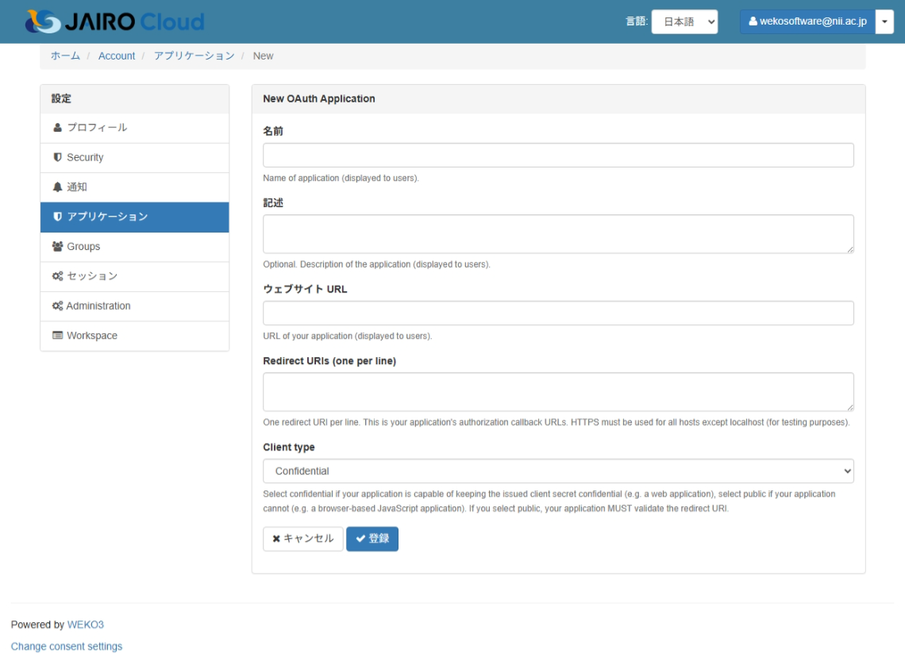
   5. 「登録」を押下します。
   6. クライアントIDとクライアントシークレットが生成されます。
        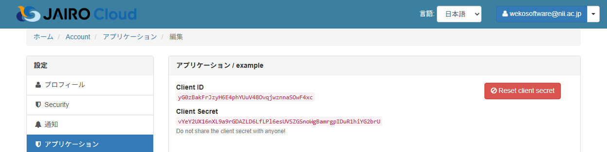

3. OA Assistへの登録
    1. OA Assistでユーザーのプルダウンをクリックし、［機関設定］を選択します。  
        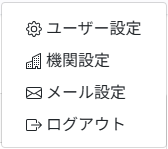  
        機関設定画面が表示されます。
    2. 以下の情報を入力します：
        - **JAIRO CloudのURL**: 機関のJAIRO Cloud URLを入力します。
        - **クライアントID**: JAIRO Cloudで発行されたクライアントIDを入力します。
        - **シークレットキー**: JAIRO Cloudで発行されたクライアントシークレットを入力します。

        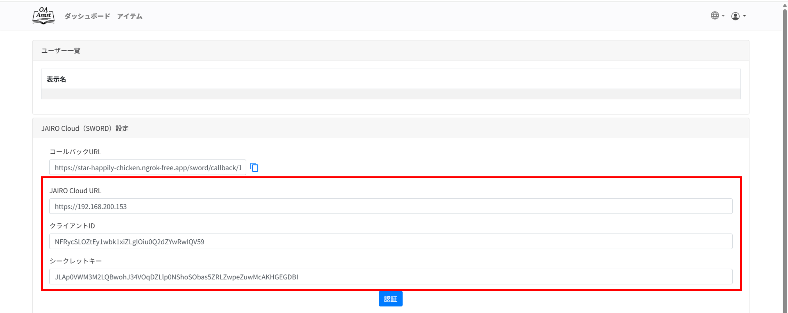
    3. ［認証］ボタンをクリックして、JAIRO Cloudとの連携を確認します。  
        JAIRO Cloudのログイン画面が表示されます。  
        ログインし［Authorize application］をクリックします。  
        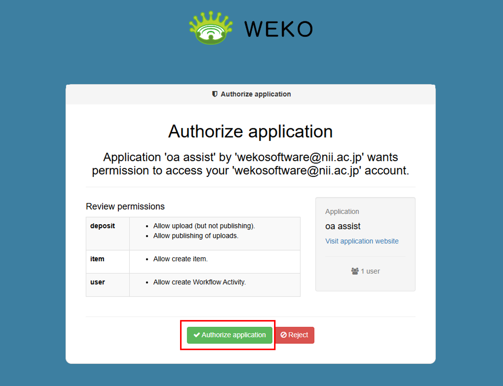
    4. 認証成功画面が表示されます。  
        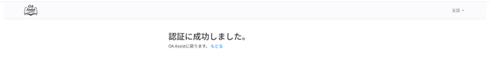
    5. 再度、機関設定画面を表示します。
    6. 送信先インデックスから、論文を登録するJAIRO Cloudのインデックスを選択し、［選択］ボタンをクリックします。  
        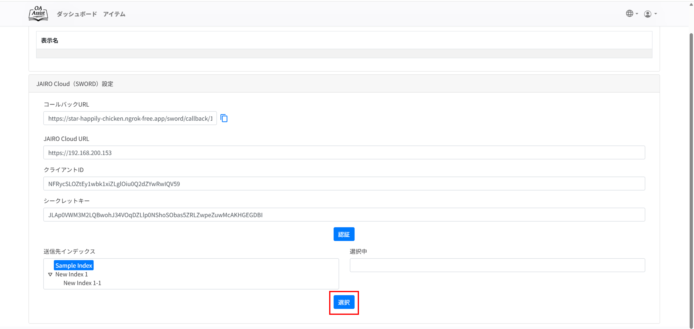
        選択したインデックスが選択中に表示されます。  

### SWORDAPI設定

1. JAIRO Cloud にアプリケーションを登録したユーザーでログイン後、右上プルダウンから「Administration」を選択します。  
    

2. 画面左のメニューから「SWORDAPI」 → 「JSON-LD」 をクリックします。  
    

3. 作成タブを選択します。  
    

4. [アプリケーション設定](#アプリケーション設定)で登録したOA Assistのアプリケーションを選択します。  
    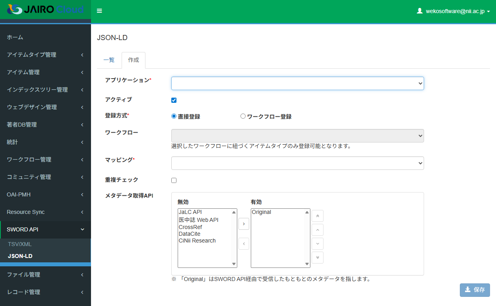

5. 登録方式はいずれかを選択します。  
   - 直接登録: アイテムを直接登録します。
   - ワークフロー登録: 指定したワークフローを経由して登録します。  

   ※ワークフロー登録を選択した場合、設定されたワークフローに承認待ちのアクティビティが残っている間は設定の変更ができなくなります。

6. マッピングは「デフォルトマッピング（フル）」を選択します。  
   登録するアイテムタイプに対応するマッピングを選択して下さい。  
   ※マッピングはワークフローで用いるアイテムタイプに対応している必要があります。

7. その他の項目は必要に応じて選択し、［保存］ボタンをクリックします。

### メールアドレスの登録

研究者のメールアドレスを登録しておくと、論文の著者に自機関の研究者が含まれている場合、本文提供依頼メールの送信先として登録したメールアドレスを利用できます。

1. ［ユーザー］プルダウンリストを押下すると設定のリストが表示されます。  
      
2. メールアドレス設定を押下するとアドレス情報一覧画面に遷移します。
    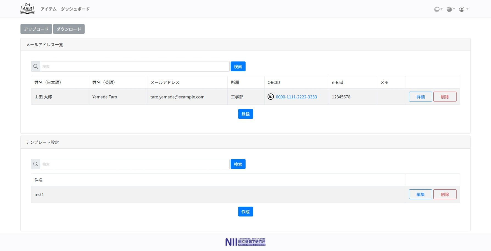
3. ［登録］ボタンをクリックして、アドレス情報の新規登録画面が表示されます。
   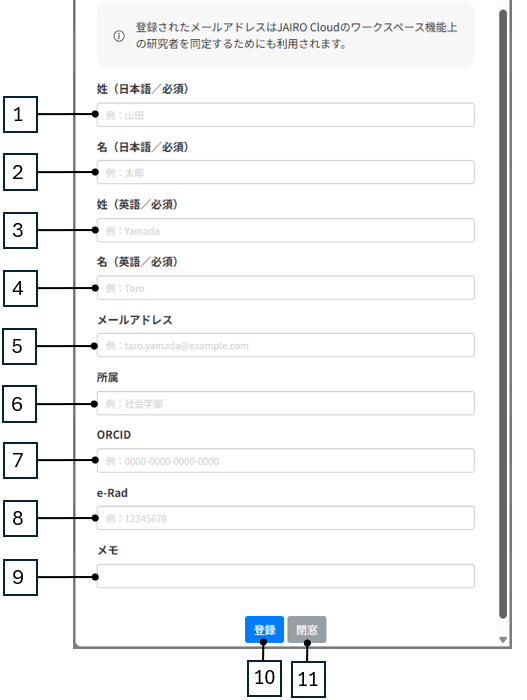
   - アドレス情報の新規登録画面各項目の説明  

   | 項番 | 項目                   | 説明                                                               |
   | ---- | ---------------------- | ------------------------------------------------------------------ |
   | 1    | [姓（日本語）]入力欄   | 登録する研究者の姓を日本語で入力します。登録の必須事項になります。 |
   | 2    | [名（日本語）]入力欄   | 登録する研究者の名を日本語で入力します。登録の必須事項になります。 |
   | 3    | [姓（英語）]入力欄     | 登録する研究者の姓を英語で入力します。登録の必須事項になります。   |
   | 4    | [名（英語）]入力欄     | 登録する研究者の名を英語で入力します。登録の必須事項になります。   |
   | 5    | [メールアドレス]入力欄 | 研究者のメールアドレスを入力します。                               |
   | 6    | [所属]入力欄           | 研究者の所属情報を入力します。                                     |
   | 7    | [ORCID]入力欄          | 研究者の ORCID を入力します。                                      |
   | 8    | [e-Rad]入力欄          | 研究者の e-Rad を入力します。                                      |
   | 9    | [メモ]入力欄           | 研究者についての情報を自由に入力することができます。               |
   | 10   | [登録] ボタン          | 押下すると、1-9番で入力した内容でアドレス情報を登録します。        |
   | 11   | [閉窓] ボタン          | 押下すると、アドレス登録画面が閉じられます。                       |

4. 各項目にアドレス情報を入力し、［登録］ボタンをクリックすると登録が完了します。  

### メールテンプレートの作成

本文提供依頼メールを効率的に送信するために、あらかじめメールテンプレートを作成しておきます。

1. メールテンプレート設定欄の［作成］ボタンを押下すると、作成画面が表示されます。  
   - メールテンプレート作成画面の項目と説明  

   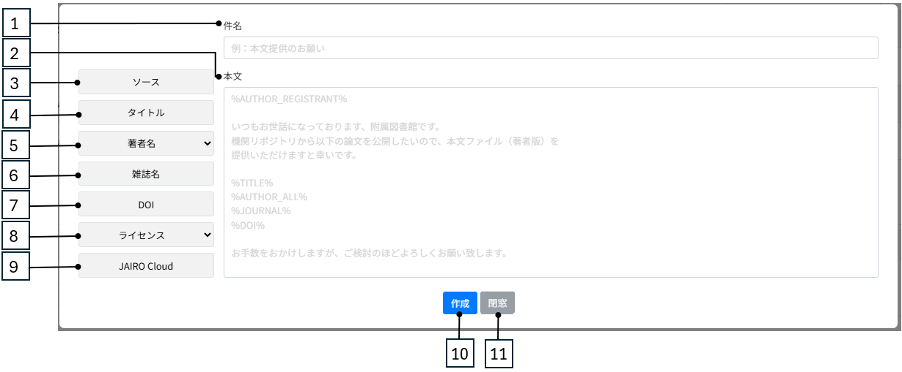

   | 項番 | 項目              | 説明                                                                                                                                                           |
   | ---- | ----------------- | -------------------------------------------------------------------------------------------------------------------------------------------------------------- |
   | 1    | 件名              | 入力欄に設定したい件名を入力します                                                                                                                             |
   | 2    | 本文              | 入力欄でテンプレートに用いる本文の内容を入力します。                                                                                                           |
   | 3    | ソースボタン      | 押下すると、アイテムの情報元リンクに置換される文字列「%SOURCE%」が入力されます。                                                                               |
   | 4    | タイトルボタン    | 押下すると、論文のタイトルに置換される文字列「%TITLE%」が入力されます。                                                                                        |
   | 5    | 著者名ボタン      | 押下すると「全著者・所属著者・登録著者」の選択肢が表示され、選択した内容に対応する置換文字列が入力されます。                                                   |
   | 6    | 雑誌名ボタン      | 押下すると、論文が掲載された雑誌名に置換される文字列「%JOURNAL%」が入力されます。                                                                              |
   | 7    | DOIボタン         | 押下すると、論文のDOIに置換される文字列「%DOI%」が入力されます。                                                                                               |
   | 8    | ライセンスボタン  | 押下すると「全パターン」、「CC BY-CC BY NC-ND」、「CC BY-NC & CC BY-NC-ND」、「CC BY-NC-ND」の選択肢が表示され、選択すると本文に対応する規約文が入力されます。 |
   | 9    | JAIRO Cloudボタン | 押下すると、JAIRO Cloud のリンクに置換される文字列「%JAIRO Cloud%」が入力されます。                                                                            |
   | 10   | 作成ボタン        | クリックするとテンプレートを登録します。                                                                                                                     |
   | 11   | 閉窓              | クリックすると作成を中止します。                                                                                                                               |

2. 入力が完了したら ［作成］ ボタンをクリックして、テンプレートを登録します。

## 対象論文の検索

本章では。収集された論文情報の中から、　JAIRO Cloudへの登録作業を行う対象論文を検索する手順を説明します。

検索条件は、機関の運用方針や登録対象とする論文の種類に応じて適宜調整してください。

### 検索画面の表示

1. 画面上部の［アイテム］タブをクリックします。  
    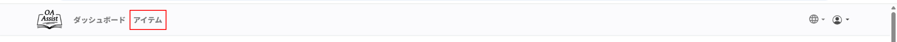

2. 所属機関が1つの場合はアイテム一覧画面が表示されます。  
    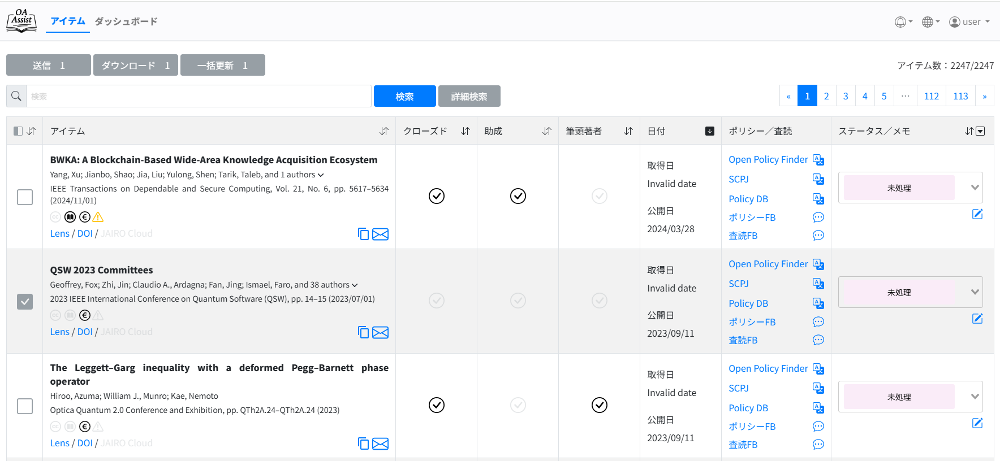

    所属機関が複数ある場合は所属機関一覧画面が表示されます。  
    機関名称の右側にある［詳細］ボタンをクリックすると、該当機関のアイテム一覧画面が表示されます。  
    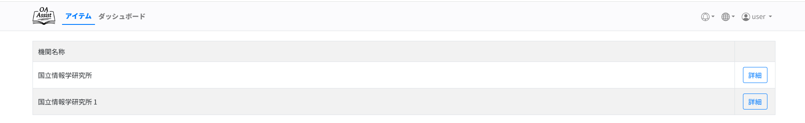

### キーワード検索

1. 検索欄にキーワードを入力します。  
    キーワードには、論文タイトル、著者名、雑誌名などを指定できます。

2. ［検索］ボタンをクリックすると、条件に一致する論文が一覧に表示されます。
    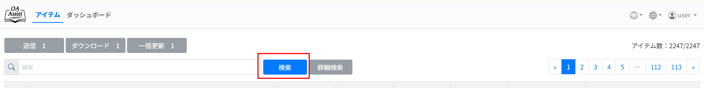

### 詳細検索

より条件を絞り込んで検索したい場合は、［詳細検索］ボタンをクリックしてフィルタ条件を設定します。  
詳細検索では、以下のような条件を組み合わせて検索できます。

以下は即時OA対象論文を絞り込む場合の設定例です。  
ほかのフィルタ項目については[OA Assistユーザーマニュアル（準備中）]()をご確認ください。

※設定例:

- **OA**  
  OA区分（オープン／クローズド）で絞り込みたい場合に指定します。

- **助成**  
  助成情報の有無で絞り込みたい場合に指定します。

- **筆頭著者**  
  筆頭著者が所属研究者である論文を抽出したい場合に指定します。

- **公開日／出版日**  
  特定の期間に公開・出版された論文を対象とする場合に指定します。

- **ステータス**  
  未処理の論文や、処理状況に応じて絞り込みたい場合に指定します。

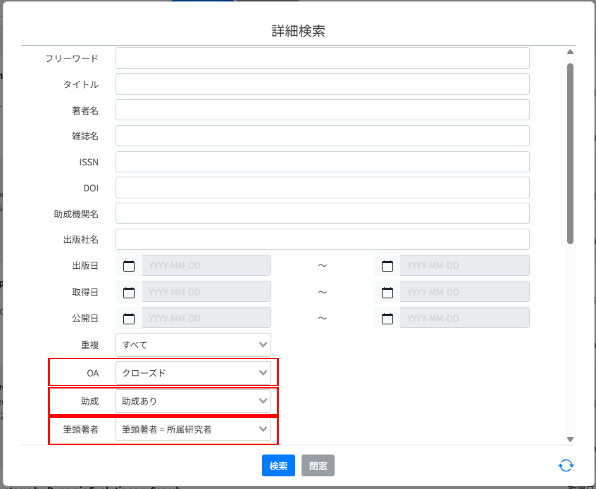

条件を設定後、［検索］ボタンをクリックすると、検索結果が表示されます。  

## ステータス

OA Assistでは、各論文の対応状況をステータスで管理します。
メール送信、本文入手、登録完了などの各工程に応じてステータスを更新することで、進捗状況を一覧で把握できます。

また、JAIRO Cloudと連携している場合は、登録状況に応じたステータス管理が可能です。  
JAIRO Cloudの研究者用ワークスペースで登録状況を確認できるほか、JAIRO Cloud側でアイテムの状態が変更された際に、OA Assist側のステータスを連動させることができます。

本マニュアルでは、各作業工程の完了時に、対応するステータスへ更新することを前提としています。
特に以下のタイミングでステータスを更新します。

- 本文提供依頼メール送信後
- 本文ファイル入手後
- JAIRO Cloudでの登録・公開完了後

実際の対応状況に応じて適切なタイミングで更新してください。

## 登録可否の確認（ポリシー・査読情報の確認）

本章では検索した論文について、JAIRO Cloudへ登録可能かどうかを確認する手順を説明します。

OA Assistでは、出版社ポリシーや査読情報など登録可否の判断に必要な情報を確認できます。  
これらの情報をもとに、登録作業に進めるかどうかを判断します。

### 査読の有無の確認

1. 検索結果一覧の確認対象とする論文の［査読FB］をクリックします。  
    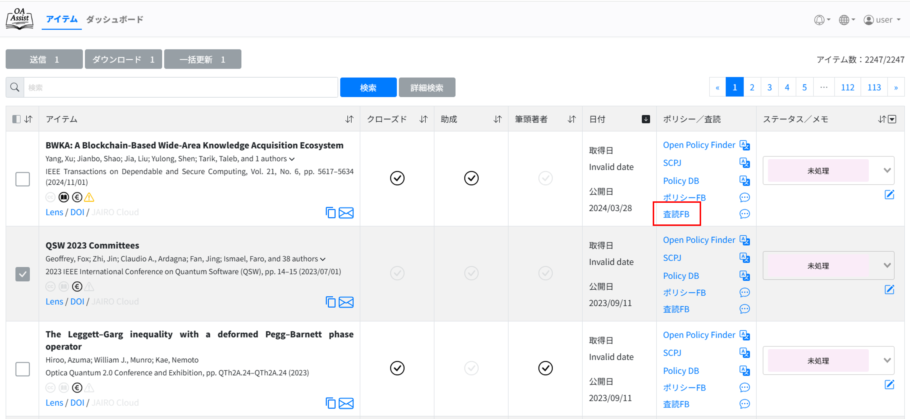

2. 査読FB一覧画面では、以下の項目から査読の有無を確認します。
    - 期間別フィードバック集計表
    - 共有事項一覧  

    下記の例では、「査読あり」のフィードバックが登録されていることから、当該論文は査読ありの論文であると判断できます。

    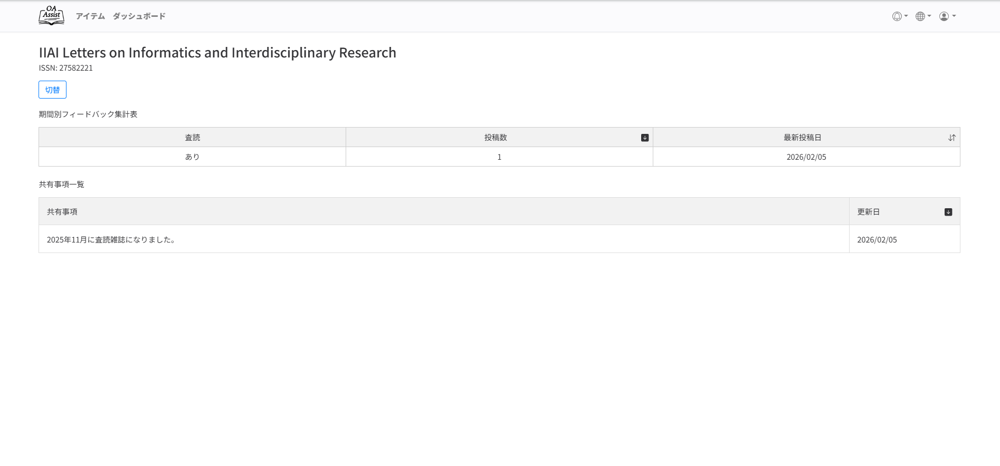  
    ※投稿規定は改定されることもあるため、より最近のフィードバックを参照してください。  

3. 対象の論文に査読フィードバックがない場合は、自分で出版社の Webサイトを調べて確認します。  
   フィードバックを作成することで、他のユーザーと情報を共有することができます。  
   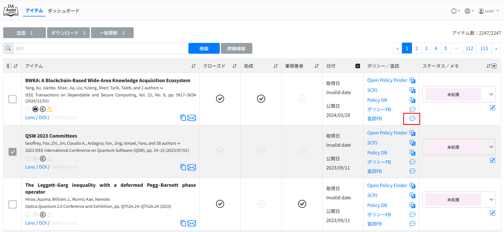

### 出版社ポリシーの確認

1. 検索結果一覧から、確認したい論文の［ポリシーFB］をクリックします。
    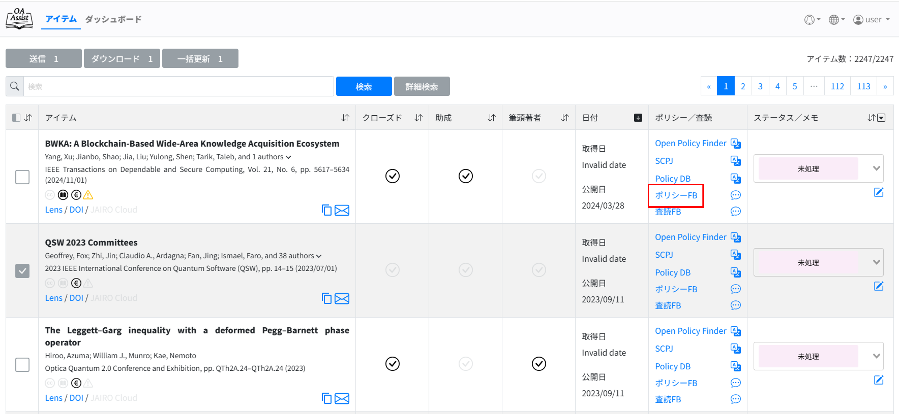

2. ポリシーFB一覧画面では、以下の項目から著作権ポリシーを確認します。
    - 期間別フィードバック集計表
    - 共有事項一覧

    下記の例では、出版社版（VoR）を投稿する場合、6か月のエンバーゴ期間が必要であり、あわせて CC BY のライセンスを記載する必要があることが分かります。

    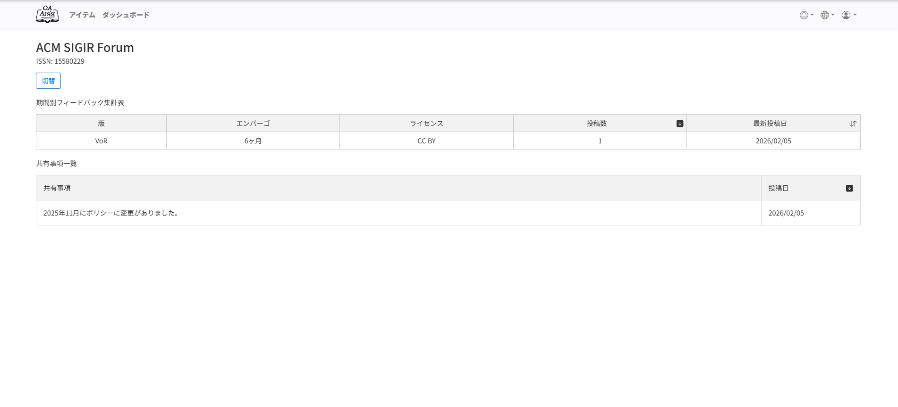
    ※投稿規定は改定されることもあるため、より最近のフィードバックを参照してください。  

3. 対象の論文にフィードバックがない場合は、Open Policy Finder、SCPJ、Policy DB などを利用して調べることができます。  
   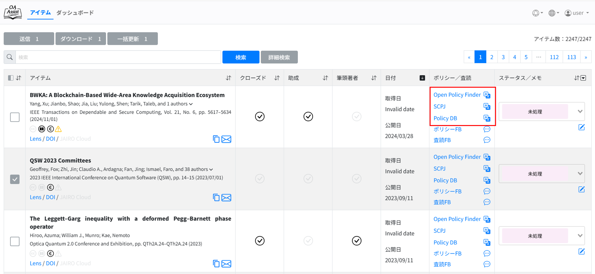

4. それでも見つからない場合は、自分で出版社の Webサイトを調べて確認します。  
   フィードバックを作成することで、他のユーザーと情報を共有することができます。  
   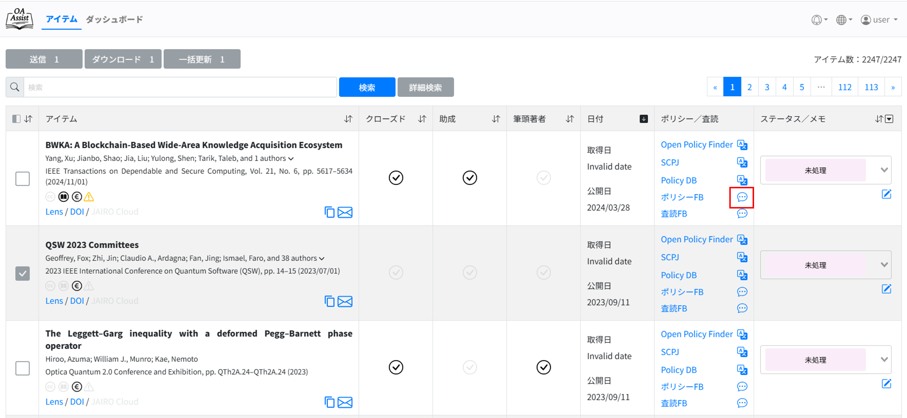

### 登録可否の判断

出版社ポリシー及び査読の有無を確認したうえで、登録作業を進めるかどうかを判断します。

- 登録が可能と判断した場合  
  → 次の章「本文提供依頼メールの送信と本文ファイル取得」に進みます。

- 現時点で登録が難しい場合  
  → 登録を保留し、必要に応じて後日対応します。

## 本文提供依頼メールの送信と本文ファイルの取得

本章では、登録作業を進めるにあたり、必要となる本文ファイルを取得するために、OA Assistのメール送信機能を利用して、著者へ本文提供依頼を行う手順を説明します。

### 本文提供依頼メールの作成

1. アイテム一覧画面で、対象論文の［メール作成］ボタンをクリックします。  
    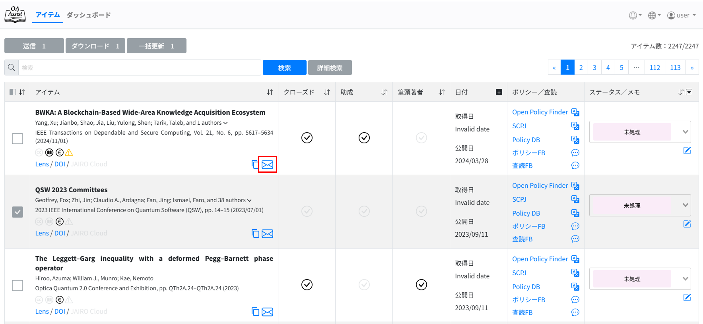

2. テンプレート選択画面が表示されます。  
    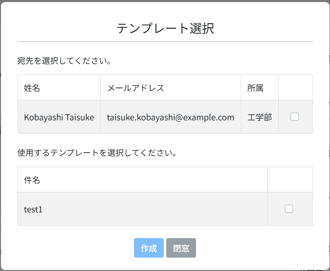

3. 使用するテンプレートのチェックボックスを押下します。

4. ［作成］ボタンをクリックすると、メールソフトが起動し、テンプレートの内容がメールに反映されます。

本文ファイルを取得できたら、次の章「JAIRO Cloudへの送信」に進みます。

## JAIRO Cloudへの送信（登録）

本章では、本文ファイルを取得した論文について、OA AssistからJAIRO Cloudへデータを送信する手順を説明します。

### JAIRO Cloudへの送信操作

1. アイテム一覧画面で、JAIRO Cloudへ送信する論文のチェックボックスを選択します。

2. ［送信］ボタンをクリックします。  
   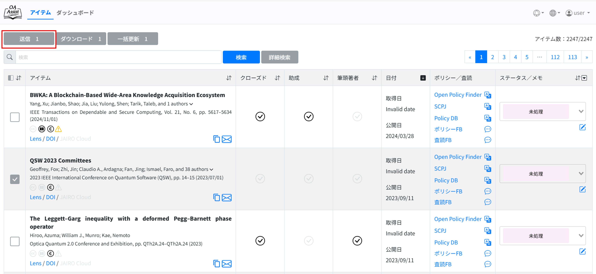

3. 送信内容の確認ダイアログが表示されます。  
    送信する情報を「アイテム」と「アイテムと参考文献情報」の中からラジオボタンで選択します
    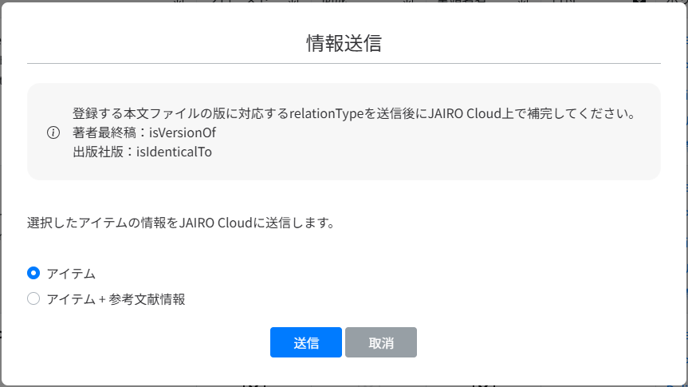

    **■ アイテム**  
    論文の基本メタデータ（タイトル、著者、雑誌情報、DOI等）のみを
    JAIRO Cloudへ送信します。

    ※参考文献情報は送信されません。  
    ※参考文献をJAIRO Cloudで管理しない場合はこちらを選択してください。

    登録結果例：
    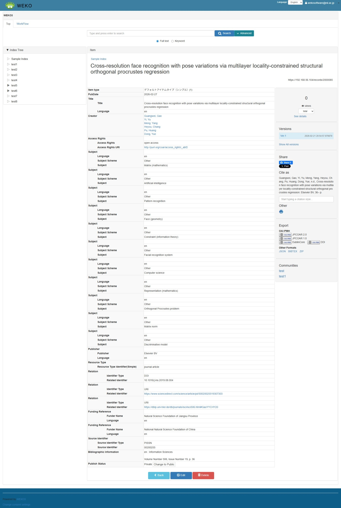

    **■ アイテム＋参考文献情報**  
    論文の基本メタデータに加えて、
    OA Assistに登録されている参考文献情報（Relation / references）も
    あわせてJAIRO Cloudへ送信します。

    ※参考文献情報もJAIRO Cloudで公開・管理したい場合はこちらを選択してください。

    登録結果例：
    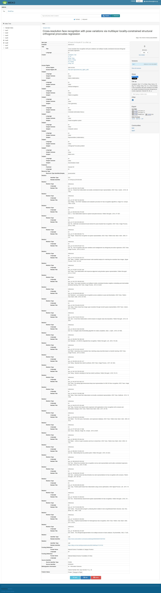

4. ［送信］ボタンをクリックします。  
   ※JAIRO Cloudの連携方式が直接登録の場合、アイテムは非公開状態で登録されます。

#### 送信後の注意事項（relationTypeの補完について）

OA AssistからJAIRO Cloudへ送信する際、J-STAGEやLENS等に掲載されている出版者版のDOIが「関連情報」として連携される場合があります。

ただし、この関連情報には relationType（本文との関係性）は設定されません。
そのため、JAIRO Cloud側で、登録する本文ファイルの版に応じて適切なrelationTypeを補完してください。

| 登録する本文ファイルの版          | 設定するrelationType |
| --------------------------------- | -------------------- |
| 著者最終稿（Accepted Manuscript） | `isVersionOf`        |
| 出版者版（Version of Record）     | `isIdenticalTo`      |

※relationTypeは、本文ファイルと関連情報（出版者版DOI等）との関係を示す項目です。

## JAIRO Cloudでの操作

本章では、OA Assistから連携された論文データをもとに、
JAIRO Cloud上でアイテムとして登録・公開するまでの作業手順を説明します。

### 送信されたアイテムの確認

1. 送信した論文の「アイテム情報」列の［JAIRO Cloud］リンクをクリックします。  
    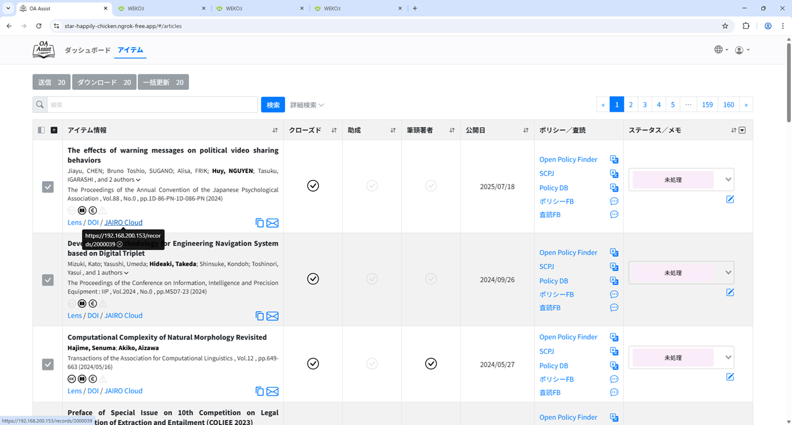

2. JAIRO Cloudの該当アイテムの詳細画面が表示されます。  
    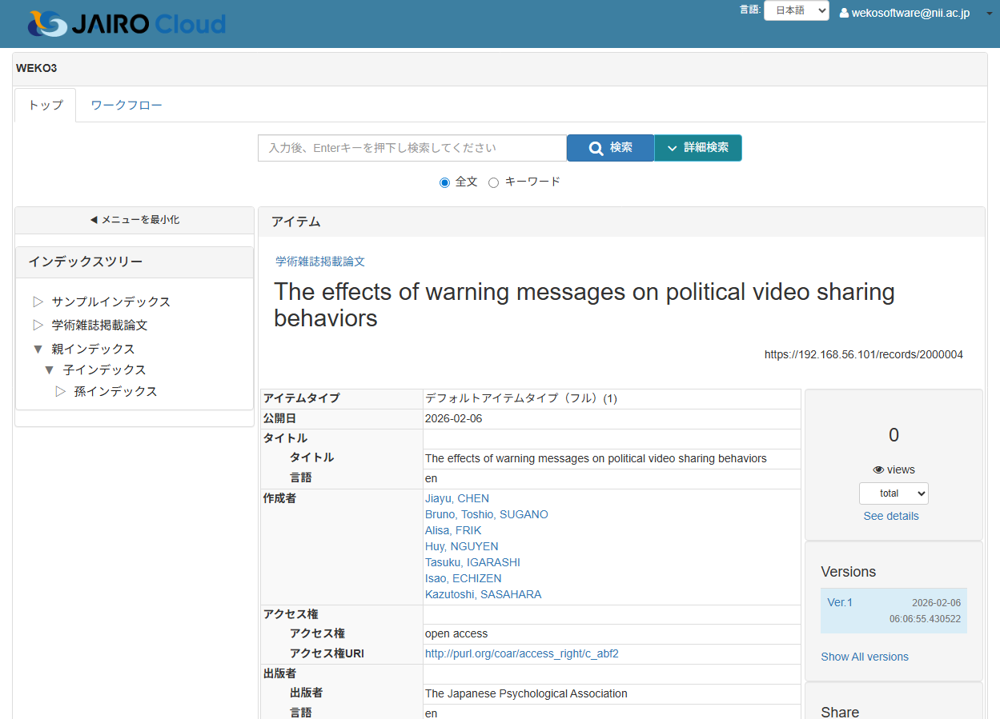

### メタデータの修正と本文ファイルの登録

1. アイテム詳細画面で、［編集］ボタンをクリックします。  
    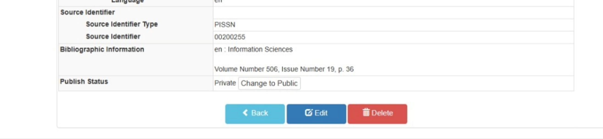
    アクティビティが新規作成され、メタデータ登録の画面が表示されます。

2. ［Click to select］ボタンをクリックして本文ファイルを登録します。  
    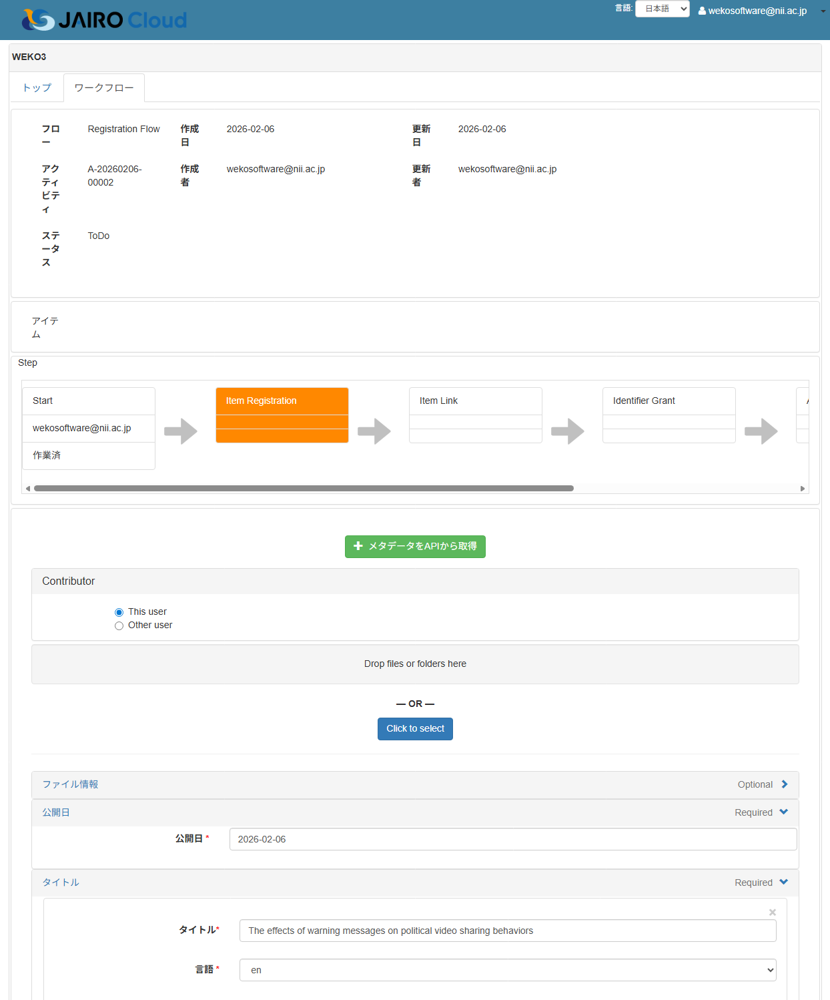
   ［Start upload］ボタンをクリックすると選択したファイルがアップロードされます。  
    ※本文ファイルの登録方法は、[JAIRO Cloudで登録する場合の操作 |ファイルのアップロード](journalPaperdeposit.md#ファイルのアップロード)もご確認ください。

3. メタデータの確認と補完を行います。OA Assistから連携されたメタデータを確認し、必要に応じて修正・補完を行います。  
    特に、OA Assistでは自動入力されない、または不十分な場合がある以下の項目について確認して下さい。
    - **ファイル情報**: 入力が必要です。
    - **作成者識別子**: NRIDやGRIDなどの非推奨の識別子が入力されている場合があります。
    - **所属機関識別子**: kakenhiやGRIDなどの非推奨の識別子が入力されている場合があります。
    - **出版タイプ**: OA Assistの情報をもとに、出版タイプ（AM または VoR）、査読の有無を入力します。
    - **関連情報.関連タイプ**: 本文ファイルの版に応じて、著者最終稿ならisVersionOf、出版社版ならisIdenticalToを選択します。
    - **助成情報**: 取得元データに十分な情報がない場合があります。
    - **権利情報**: 取得元データに十分な情報がない場合があります。

    ※入力するメタデータの詳細や登録時の操作については[JAIRO Cloudから登録する場合の操作](journalPaperdeposit.md#メタデータ入力画面での入力・選択)を参照してください。

4. ワークフローを完了まで進めます。  
    ※アイテムを登録するインデックスを変更する場合は、OA Assistで送信先インデックスを変更することも可能ですが、
    運用上の混乱を避けるため、1つのインデックスに送信し、メタデータ編集時に正しいインデックスへ登録しなおす方法を推奨します。

5. 登録完了
