# JAIRO Cloud（WEKO3）登録ガイド　研究データ編<!-- omit from toc -->

ここでは、研究データをJAIRO Cloudに登録する時の流れについて説明します。

詳細は「[機関リポジトリへの研究データ登録ガイドライン](https://jpcoar.org/system/wp-content/uploads/2025/09/research_data_registration_guideline.pdf)」にもありますので、そちらもチェックしてください。

CiNii Researchへの収録に関しては以下をチェックしてください。[「研究データ」「根拠データ」の収録について | 学術コンテンツサービス サポート](https://support.nii.ac.jp/ja/cir/researchdata_harvest)

ここでは様式（A）（またはパターン1）の「研究データ」として個別に登録をする時の流れを説明します。

操作に関しては、[基本マニュアル個別登録編](https://jpcoar.org/support/jairo-cloud/manual/basic-operations/)もご参照ください。

また、操作に関する資料（動画等）やお問い合わせ先は[JAIRO Cloudサポートポータル](https://jpcoar.org/support/jairo-cloud/portal/)に掲載されていますので、ぜひご確認ください。

## 目次・全体の流れ<!-- omit from toc -->

- [1 リポジトリに登録する研究データ](#1-リポジトリに登録する研究データ)
- [2 下準備](#2-下準備)
- [3 JAIRO Cloudから登録する操作手順](#3-jairo-cloudから登録する操作手順)
  - [3.1 概要](#31-概要)
  - [3.2 ログイン後からワークフロー開始まで](#32-ログイン後からワークフロー開始まで)
  - [3.3 Item Registration画面の概要](#33-item-registration画面の概要)
    - [3.3.1 画面全体の構成](#331-画面全体の構成)
    - [3.3.2 操作の流れ（この画面で行うこと）](#332-操作の流れこの画面で行うこと)
  - [3.4 ファイルのアップロード](#34-ファイルのアップロード)
  - [3.5 メタデータ入力画面での入力・選択](#35-メタデータ入力画面での入力選択)
  - [3.6 メタデータ入力画面末尾で「次へ」を選択した後の操作](#36-メタデータ入力画面末尾で次へを選択した後の操作)
    - [3.6.1 インデックスの指定](#361-インデックスの指定)
    - [3.6.2 アイテム間リンク](#362-アイテム間リンク)
    - [3.6.3 DOIの付与](#363-doiの付与)
  - [3.7 アクティビティの承認](#37-アクティビティの承認)
  - [3.8 ワークフロー完了](#38-ワークフロー完了)
  - [3.9 登録完了（登録見本）](#39-登録完了登録見本)
  - [3.10 ハーベスト結果の確認](#310-ハーベスト結果の確認)
- [4 GakuNin RDM-JAIRO Cloud連携を利用した場合の操作（概要）](#4-gakunin-rdm-jairo-cloud連携を利用した場合の操作概要)
- [5 補足](#5-補足)
  - [5.1 CCライセンスの付与について](#51-ccライセンスの付与について)

## 1 リポジトリに登録する研究データ

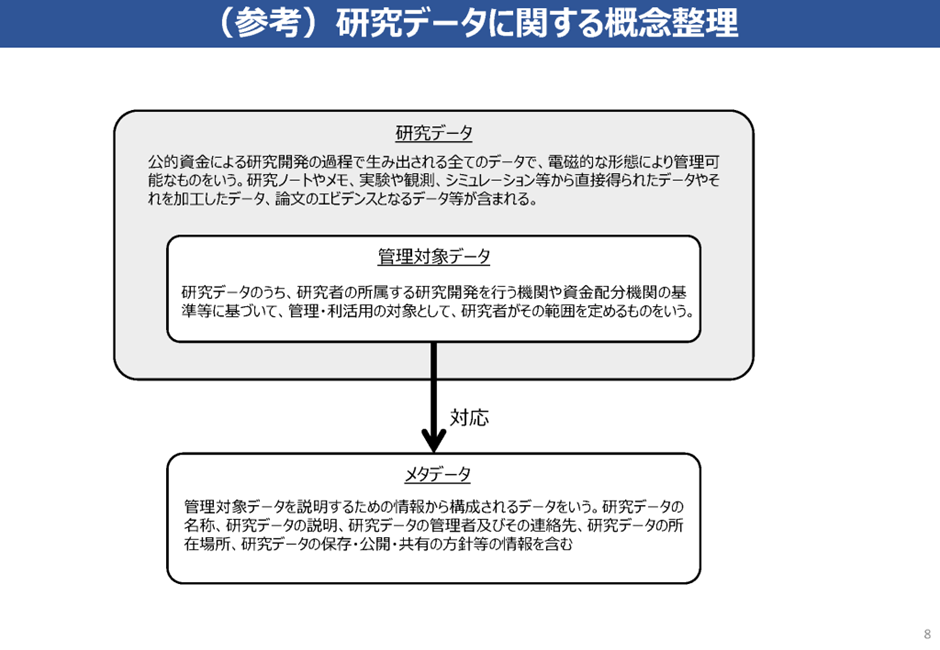

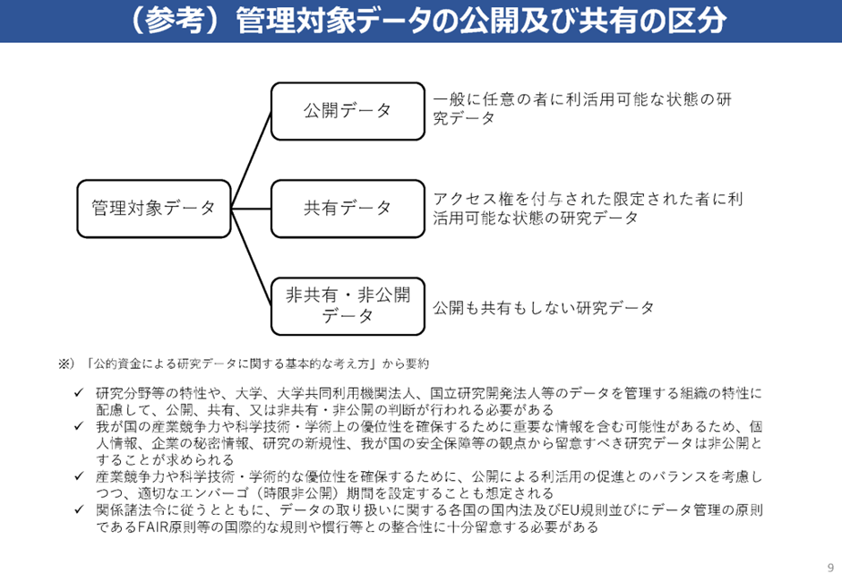

内閣府「公的資金による研究データの管理・利活用に関する進捗と事例～研究データ2024～」より

上の図のうち、基本的にリポジトリで公開するのは「公開データ」です。（「共有データ」を登録する場合もありますが、このマニュアルでは「公開データ」を前提とします）

「公開データ」のうち、論文の掲載電子ジャーナルの執筆要領、出版規程等において、透明性や再現性確保の観点から必要とされ、公表が求められるデータが「根拠データ」で、「根拠データ」は即時OA義務化の対象です。

## 2 下準備

下準備については、「[機関リポジトリへの研究データ登録ガイドライン](https://jpcoar.org/system/wp-content/uploads/2025/09/research_data_registration_guideline.pdf)」p.10-13に詳細な内容があります。

- **研究データのOAのためリポジトリ担当者が行うこと**  
  ➀ 研究データ（根拠データ）をオープンアクセスにする場合どうするか、教員が迷わないように案内を行う。  
  → データ公開にあたって研究者側の責任で確認いただく事項（個人情報等）をチェックするためや、メタデータを漏れなく教えてもらうために、Excelやフォームを利用した様式を作成する。あるいは、どの項目を登録するか明確にしておき、教員から来たメタデータが不足している場合は照会できるようにしておく。

  ※論文と異なり、データからだけだと登録に必要なメタデータを読み取ることが難しい。

  ➁ 機関リポジトリに、OAになっていない研究データを登録する。  
  （OA済みの研究データを、さらに機関リポジトリへ登録することも可能）

  ③ NII RDC上で研究データとそれに関連する論文を検索できるようにする＝IRDBにきちんとハーベストされるようにする

## 3 JAIRO Cloudから登録する操作手順

### 3.1 概要

操作は基本マニュアルの[アイテム個別登録](https://jpcoar.org/support/jairo-cloud/manual/item-registration/)で説明している内容と同じです。研究データを登録する時に、どの項目に何を入れていくかをメインに説明します。

なお、本文中で参照・リンクしている[JPCOARスキーマのバージョンは2.0](https://schema.irdb.nii.ac.jp/ja/schema?version=257)です。バージョンにより差異が発生する可能性がありますので、ご留意ください。

登録作業は以下の流れで行います。

1. ワークフローのアクティビティを作成
2. メタデータを入力
3. アイテムにその他の情報を登録
4. リポジトリ担当者が承認
5. 登録完了
6. 登録結果の確認（JAIRO Cloud）
7. ハーベスト結果の確認（IRDB）

### 3.2 ログイン後からワークフロー開始まで

1. ログイン後、トップ画面のメニューから［ワークフロー］タブをクリックします。
  
  ［アクティビティ一覧］画面が表示されます。

2. 表示された［アクティビティ一覧］画面の右下にある［+新規アクティビティ］ボタンをクリックします。
  
  ［ワークフロー選択］画面が表示されます。

3. 表示された［ワークフロー選択］画面のデフォルトアイテムタイプ（フル）の［+New］ボタンをクリックします。  
  ※このマニュアルの説明では、デフォルトアイテムタイプ（フル）を利用して登録します。自機関でどうしても追加したい（表示させたい）項目がない限りは、デフォルトアイテムタイプ（フル）を利用して登録することを推奨します。
  
  アイテムのメタデータとコンテンツを登録する画面が表示されます。

### 3.3 Item Registration画面の概要

この画面では、ファイルのアップロードとメタデータの入力を行います。

#### 3.3.1 画面全体の構成

Item Registration画面は、主に次の項目で構成されています。

| 項番 | 項目                       | 説明                                                                                                                                                                                                |
| ---- | -------------------------- | --------------------------------------------------------------------------------------------------------------------------------------------------------------------------------------------------- |
| 1    | ファイルアップロードエリア | ファイルをドラッグアンドドロップまたは［Click to select］ボタンからファイルをアップロードします。                                                                                                   |
| 2    | メタデータ入力エリア       | 複数のパネルに分かれており、タイトル、作成者、権利情報などを入力します。  ［v］/［>］ボタンを操作することでパネルの開閉が可能です。 <b>※初期状態で展開されているパネルは入力必須項目です。<b> |
| 3    | ［削除］ボタン             | クリックすると、選択されているメールアドレスがフィードバックメール送信先から削除されます。                                                                                                          |
| 4    | ［保存］ボタン             | クリックすると、入力した内容が一時保存されます。                                                                                                                                                    |
| 5    | ［次へ］ボタン             | クリックすると、［インデックス指定］画面に遷移します。                                                                                                                                              |
| 6    | ［強制終了］ボタン         | クリックすると、入力した内容を破棄し、作業中のアクティビティを中止します。                                                                                                                          |
| 7    | ［戻る］ボタン             | クリックすると、入力した内容は保存されず［ワークフロー選択］画面に遷移します。                                                                                                                      |

#### 3.3.2 操作の流れ（この画面で行うこと）

1. ファイルアップロード
   - 研究データファイルをアップロードします。
   - アップロード後、ファイル情報（ライセンス、アクセス権など）を入力します。

2. メタデータ入力
   - タイトル、作成者情報、権利情報、助成情報などを入力します。

3. 確認と次のステップ
   - 入力が完了したら「次へ」をクリックし、インデックス指定や承認画面に進みます。

次章では、ファイルアップロードの具体的な操作を詳しく説明します。

### 3.4 ファイルのアップロード

研究データファイルをアップロードします。

1. ［Drop files or folders here］に登録するファイルをドラッグ＆ドロップします。または［Click to select］ボタンをクリックすると表示される［アップロードファイル選択］ダイアログで、アップロードするファイルを選択後、［開く］ボタンをクリックします。

ファイル名とサイズが表示されます。

1. 表示されたファイル情報の［Start upload］ボタンをクリックします。  

ファイルがアップロードされるとProgressに[✓]が表示されます。

### 3.5 メタデータ入力画面での入力・選択

黄色のハイライト部分は入力必須の項目で、その他の項目も可能な限り入力が推奨されますが、**太字**のものは特に推奨される項目です。※青字のものはJPCOARスキーマガイドラインへのリンクがあります。

なお、本文中で参照・リンクしている[JPCOARスキーマのバージョンは2.0](https://schema.irdb.nii.ac.jp/ja/schema?version=257)です。バージョンにより差異が発生する可能性がありますので、ご留意ください。

- **ファイル情報**

| 項番| 項目 | 入力・選択内容 |
| --- | --- | --- |
| 1 | 【ファイル情報】  [【本文URL】](https://schema.irdb.nii.ac.jp/ja/schema/2.0/43-.1)→【オブジェクトタイプ】 | 原則「dataset」を選択 |
| 2 | 【ファイル情報】  [【日付】](https://schema.irdb.nii.ac.jp/ja/schema/2.0/43-.4) | 個別ファイルに関連する日付はこちらに記入する。記入方法は[【日付】](#date)参照。 |
| 3 | 【ファイル情報】  **【ライセンス】** | 著者の指定に従って、ライセンス情報がある場合は選択（もしくは自由記述）する。※詳しくは補足[「CCライセンスの付与について」](#ccライセンスの付与について)へ ※ここに入力するのはあくまでファイルのライセンス情報で、ここに入力しただけではメタデータとして流通しません。必ず 【権利情報】 にも入力します。 |
| 4 | 【ファイル情報】  **【アクセス】** | ファイル個別のアクセス権を選択する。 ・エンバーゴなし：「オープンアクセス」を選択。   ・エンバーゴあり：「オープンアクセス日を指定する」を選択。【日付】部分でも記入したエンバーゴの解禁日を再び入れる。 |

  入力例：
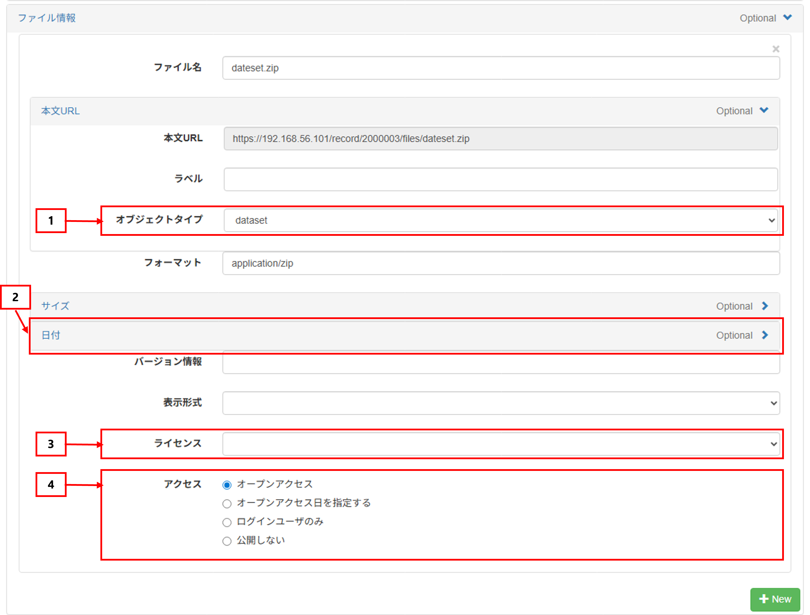

- **公開日・タイトル**

| 項番 | 項目                                                                                                 | 入力・選択内容                                                                                                                       |
| ---- | ---------------------------------------------------------------------------------------------------- | ------------------------------------------------------------------------------------------------------------------------------------ |
| 1    | 【公開日】                                                    | リポジトリに登録する日を選択する（基本的には登録作業を行っている日）。                                                               |
| 2    | [【タイトル】](https://schema.irdb.nii.ac.jp/ja/schema/2.0/1) | データのタイトルと言語を入力する。 ※斜体や特殊文字も登録可能ですが、CiNiiやほかサービスに連携した際に文字化けする場合があります。 |

入力例：
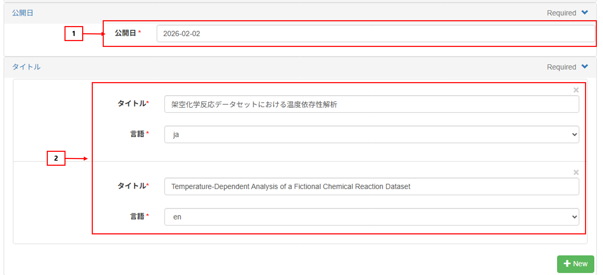

- **作成者**

| 項番 | 項目 | 入力・選択内容 |
| --- | --- | --- |
| 1 | 【作成者】  [作成者識別子](https://schema.irdb.nii.ac.jp/ja/schema/2.0/3-.1) | 「データ作成者のe-Rad研究者番号とORCID」を記入する。 ※e-Rad研究者番号・ORCIDは[KAKEN](https://nrid.nii.ac.jp/index/)や[researchmap](https://researchmap.jp/researchers)で確認できる。 |
| 2 | **【作成者】**  [**作成者姓名**](https://schema.irdb.nii.ac.jp/ja/schema/2.0/3-.2) | 「姓, 名」の形で入力する。 例：公開, 太郎/Koukai, Taro |
| 3 | 【作成者】  作成者所属.[所属機関識別子](https://schema.irdb.nii.ac.jp/ja/schema/2.0/3-.6-.1) | 作成者の所属機関識別子（RORが推奨される）を入力する。 ※RORは[Research Organization Registry (ROR) \| Home](https://ror.org/)の検索窓に英語で大学名を入れて検索するとヒットするURI形式（`https://ror.org/…`）のもの。 |
| 4 | 【作成者】  作成者所属.[所属機関名](https://schema.irdb.nii.ac.jp/ja/schema/2.0/3-.6-.2) | 作成者の所属機関名を入力する。 |

入力例：

**※複数作成者や作成者姓名の別名（日・英・カナ）を入力する場合の注意**  
複数の作成者を登録する場合や、作成者姓名の別名（日本語／英語／カナ）を入力する場合は、「+New」ボタンを押す箇所を間違えないように注意してください。  
「+New」ボタンは入力項目ごとに複数表示されており、誤った箇所のボタンを押すと、意図しない構造のメタデータが登録される場合があります。  

下図のように、  
- ①：作成者姓名の別名を追加するための「+New」
- ②：作成者を追加するための「+New」

を確認し、追加したい内容に対応する番号のボタンを押してください。

- **寄与者**  

| 項番 | 項目                                                                           | 入力・選択内容                                                                                                                                                                                                                          |
| ---- | ------------------------------------------------------------------------------ | --------------------------------------------------------------------------------------------------------------------------------------------------------------------------------------------------------------------------------------- |
| 1    | [【寄与者】](https://schema.irdb.nii.ac.jp/ja/schema/2.0/4)[0]                 | データ管理機関を記録するときは、寄与者タイプに **「HostingInstitution」** を選択する。                                                                                                                                                  |
| 2    | 【寄与者】[0].[寄与者識別子](https://schema.irdb.nii.ac.jp/ja/schema/2.0/4-.1) | データ管理機関の識別子を入力します。 寄与者識別子Schemeは **「ROR」** を指定してください。 ※寄与者のRORについては、`https://ror.org/`は不要で、識別子のみを記入する                                                                                                                                           |
| 3    | 【寄与者】[0].[寄与者姓名](https://schema.irdb.nii.ac.jp/ja/schema/2.0/4-.2)   | データ管理機関名を入力する。                                                                                                                                                                                                            |
| 4    | [【寄与者】](https://schema.irdb.nii.ac.jp/ja/schema/2.0/4)[1]                 | データ管理者を記録するときには、寄与者タイプに **「DataManager」** を選択する。                                                                                                                                                         |
| 5    | 【寄与者】[1].[寄与者識別子](https://schema.irdb.nii.ac.jp/ja/schema/2.0/4-.1) | データ管理者の **e-Rad研究者番号**を入力します。 研究者番号がない管理者や、管理者が組織の場合は不要。                                                                                                                                |
| 6    | 【寄与者】[1].[寄与者姓名](https://schema.irdb.nii.ac.jp/ja/schema/2.0/4-.2)   | データ管理者（個人名または担当部署名）を入力します。 名前タイプに、部署名の場合は「Organizational」を、個人名の場合は「Personal」を選択します。 ※個人情報保護の観点から、個人名を避け、部署名等を記録することが推奨されています。 |
| 7    | [【寄与者】](https://schema.irdb.nii.ac.jp/ja/schema/2.0/4)[2]                 | データ管理者の連絡先を記録するときは、寄与者タイプに **「ContactPerson」** を選択する。                                                                                                                                                 |
| 8    | 【寄与者】[2].[寄与者姓名](https://schema.irdb.nii.ac.jp/ja/schema/2.0/4-.2)   | 当該研究データの管理者（管理部署）の連絡先を入力します。 ※本来姓名を記載する項目ですが、この項目が自由記述欄であることを活用し、個人名ではなく、メールアドレス等を記載する運用としています。                                         |

※詳細は以下の資料を参照してください。

- JPCOAR「研究データ登録ガイドライン」https://jpcoar.org/system/wp-content/uploads/2025/09/research_data_registration_guideline.pdf
- 国立国会図書館サーチ「研究データの登録に関するガイドライン」https://ndlsearch.ndl.go.jp/guideline/researchdata#main_11

入力例：
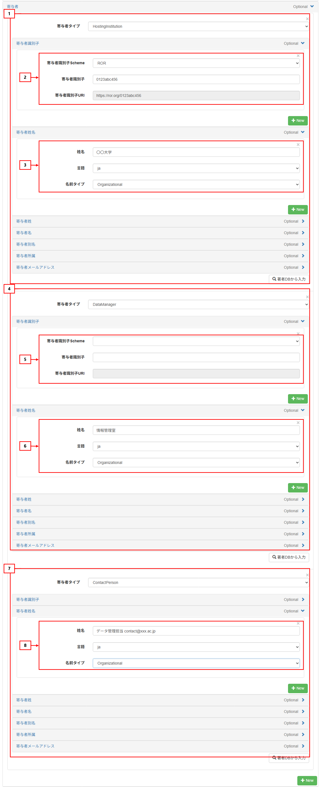

- **アクセス権・権利情報**

| 項番 | 項目 | 入力・選択内容 |
| --- | --- | --- |
| 1 | [**【アクセス権】**](https://schema.irdb.nii.ac.jp/ja/schema/2.0/5) | エンバーゴなし：「open access」を選択。 エンバーゴあり：「embargoed access」を選択。 ※「embargoed access」を選択した場合、エンバーゴ期間経過後「open access」に変更する。 |
| 2 | [**【権利情報】**](https://schema.irdb.nii.ac.jp/ja/schema/2.0/6) | 権利情報を入力する。 （例：©2025 The Authors./ https://creativecommons.org/licenses/by/4.0/） 「データの利活用・提供方針」があればこちらに入力する。これに関しても作成者から事前に聞いておくとスムーズ。（例：無償。ただしクレジット表記を条件とする。）   ※CCライセンスの時は補足[「CCライセンスの付与について」](#ccライセンスの付与について)を参照  ※研究者には[「研究データの公開・利用条件指定ガイドライン」](https://japanlinkcenter.org/rduf/doc/rduf_license_guideline.pdf)等を参考に「データの利活用・提供方針」を定めるよう周知する。 |

入力例：
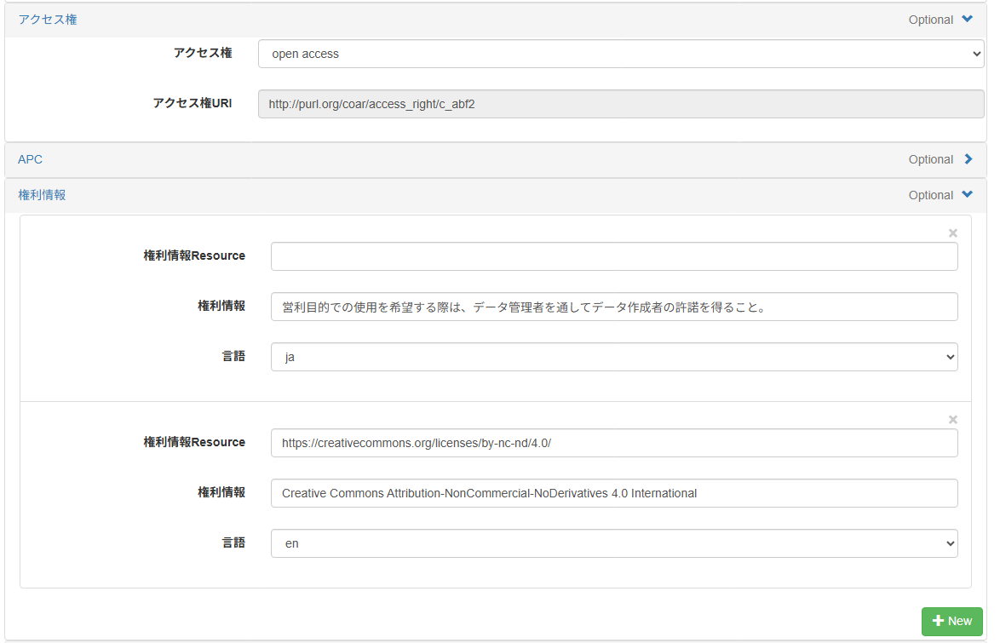

- **主題**

| 項番 | 項目 | 入力・選択内容 |
| --- | --- | --- |
| 1 | 【主題】 | データに対応するe-Rad研究分野を入れる。 |

入力例：
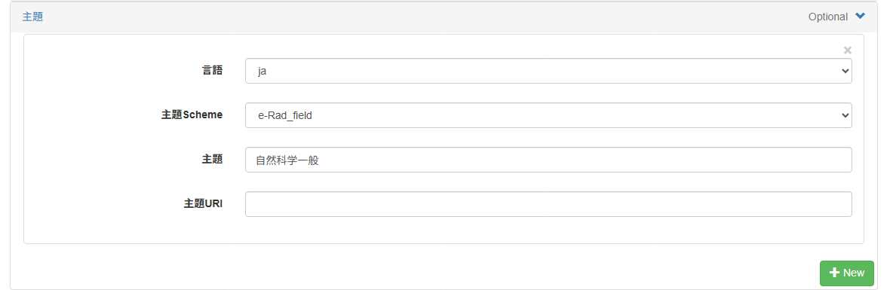

- **内容記述**

| 項番 | 項目 | 入力・選択内容 |
| --- | --- | --- |
| 1 | [**【内容記述】**](https://schema.irdb.nii.ac.jp/ja/schema/2.0/9) | データの内容に関する説明を入力する。（内容記述タイプはOtherか（技術的な情報の場合）TechnicalInfoを選択し、言語も選択する） 例：〇〇のシミュレーションにおいて〇〇の条件のもとで得られたデータ   ※データタイトルも含め、教員に事前に教えてもらうのが望ましい。 |

入力例：
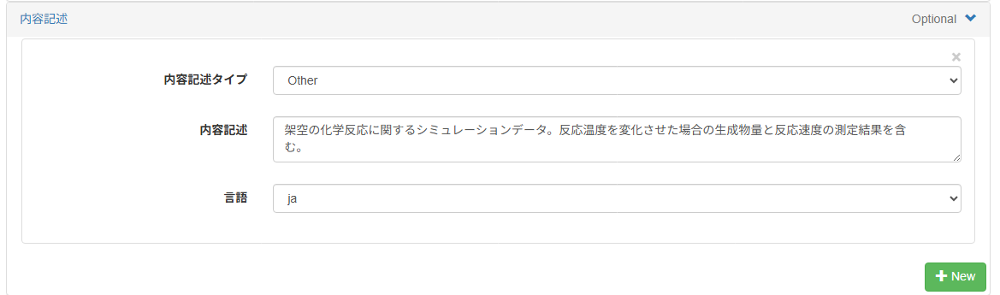

- **日付・資源タイプ**

| 項番 | 項目 | 入力・選択内容 |
| --- | --- | --- |
| 1 | [**【日付】**](https://schema.irdb.nii.ac.jp/ja/schema/2.0/12) | 日付（YYYY-MM-DD形式）を選択する。複数入力することも可能。   日付タイプは、Collected（収集日）やCreated（作成日）など研究データの特性や作成日などに応じて選択する。 掲載日はIssued（発行日）、掲載更新日はUpdated（最終更新日）を選択する。  エンバーゴがある場合、dateTypeに"Available"を指定し、利用開始日を記入する。 |
| 2 | [【資源タイプ】](https://schema.irdb.nii.ac.jp/ja/schema/2.0/15) | [JPCOARスキーマの統制語彙集](https://schema.irdb.nii.ac.jp/ja/2.0/resource_type_vocabulary)の「Dataset」項を参考に選択する。（事前に教員に指定してもらうとスムーズ） |

入力例：
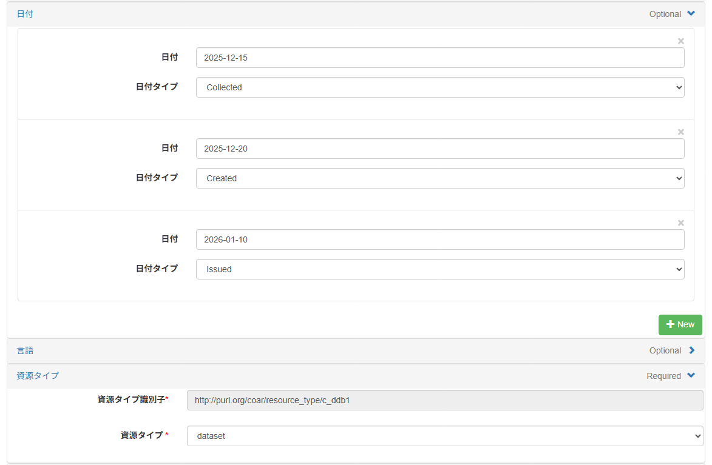

- **関連情報**

| 項番 | 項目 | 入力・選択内容 |
| --- | --- | --- |
| 1 | 【関連情報】  [**関連識別子**](https://schema.irdb.nii.ac.jp/ja/schema/2.0/20-.1)、[**関連名称**](https://schema.irdb.nii.ac.jp/ja/schema/2.0/20-.2) | 論文と紐づくデータの場合、 ・【関連識別子】：論文のDOIかURLのリンクを入れる  ※リポジトリで論文（著者最終稿を含む）を公開している場合、出版社版へのリンクとリポジトリの公開先へのリンクをいずれも入れることが望ましい。  ・【識別子タイプ】：DOIかURIの対応する方を選択  ・【関連タイプ】：論文との関係性を選択（「isSupplementTo」が一般的） を入れて論文との関連性を示す。詳しくは[JPCOARスキーマの関連情報](https://schema.irdb.nii.ac.jp/ja/schema/2.0/20)項を参照 ※データNo.が教員によって付与された後（科研費の場合、研究実績報告時に付与することになる）、希望があれば、以下のようにデータNo.をリポジトリ上で記載する。 ・【関連名称】「体系的番号－（ハイフン）当該課題の通し番号－（ハイフン）（必要な場合）枝番」（例：JP25KF0049－01－01） を入れる。 ・【識別子タイプ】：Localを選択する。 ・【関連タイプ】：isIdenticalToを選択する。 |

入力例：
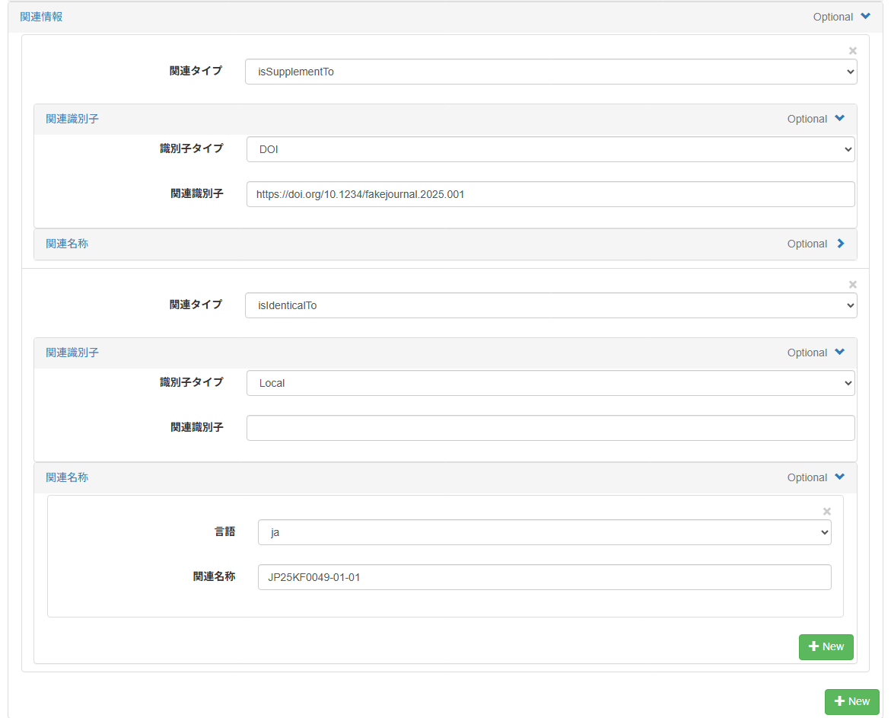

- **助成情報**

| 項番 | 項目 | 入力・選択内容 |
| --- | --- | --- |
| 1 | 【助成情報】  [助成機関識別子](https://schema.irdb.nii.ac.jp/ja/schema/2.0/23-.1). 識別子タイプ | 助成機関識別子タイプを入力する。   例：e-Rad_funder |
| 2 | 【助成情報】  [助成機関識別子](https://schema.irdb.nii.ac.jp/ja/schema/2.0/23-.1).助成機関識別子 | 助成機関識別子を入力する（以下は日本学術振興会の例）。   例：識別子：1025 　　タイプURI：https://www.e-rad.go.jp/datasets/files/haibunkikan.csv |
| 3 | 【助成情報】  [助成機関名](https://schema.irdb.nii.ac.jp/ja/schema/2.0/23-.2)[0]. 助成機関名 | 助成機関名を入力する。※言語はjaを選択   例：独立行政法人日本学術振興会|
| 4 | 【助成情報】  [助成機関名](https://schema.irdb.nii.ac.jp/ja/schema/2.0/23-.2)[1]. 助成機関名 | 助成機関名を入力する。※言語はenを選択   例：Japan Society for the Promotion of Science |
| 5 | 【助成情報】  [プログラム情報](https://schema.irdb.nii.ac.jp/ja/schema/2.0/23-.4)[0] | プログラム情報を記入する。※言語はjaを選択   例：科学研究費助成事業 |
| 5 | 【助成情報】  [プログラム情報](https://schema.irdb.nii.ac.jp/ja/schema/2.0/23-.4)[1] | プログラム情報を記入する。※言語はenを選択   例：Grants-in-Aid for Scientific Research (KAKENHI) |
| 6 | 【助成情報】  [研究課題番号](https://schema.irdb.nii.ac.jp/ja/schema/2.0/23-.5).研究課題番号 | 研究課題番号を入力する。研究課題番号タイプは「JGN」を選択する。   例：JP24K00366 |
| 7 | 【助成情報】  [研究課題番号](https://schema.irdb.nii.ac.jp/ja/schema/2.0/23-.5).研究課題番号URI | 研究課題番号URIを入力する。   例：https://kaken.nii.ac.jp/ja/grant/KAKENHI-PROJECT-24K00366/ |
| 8 | 【助成情報】  [研究課題名](https://schema.irdb.nii.ac.jp/ja/schema/2.0/23-.6)[0].研究課題名 | 研究課題名（日本語）を入力する。※言語はjaを選択   例：師範学校附属国民学校における学童疎開史の解明と教育現場での活用に関する総合的研究 |

入力例：

### 3.6 メタデータ入力画面末尾で「次へ」を選択した後の操作

#### 3.6.1 インデックスの指定

1. ［インデックスツリー］でアイテムを登録したいインデックスのチェックボックスにチェックを入れます。  
   ※ 複数インデックスに登録できるため、指定するインデックスに注意してください。
    
   チェックしたインデックス名が表示されます。  

   ※子インデックスを選択する場合  
  「▶」をクリックして子インデックスを表示し、アイテムを登録したいインデックスのチェックボックスにチェックを入れます。
  

1. ［次へ］ボタンをクリックします。  
［コメント入力］画面が表示されます。  
   

   ※下の図のように、登録作業中のコメントを入力することができます。（アイテムのメタデータには含まれず、登録作業中のみ確認することができます。）  
   必要に応じて入力してください。
   

1. ［次へ］ボタンをクリックします。  
［Item Registration］アクションが完了します。

#### 3.6.2 アイテム間リンク

別に登録した論文アイテムがある場合に、その論文を研究データに関連付けることができます。

- **注意事項**
  - **アイテム間リンクを一度作成すると削除できない不具合が発生する場合がありますので、ご注意ください。**
  - 関連付ける論文をメタデータの登録時に【関連情報】に入力している場合は必要ありません。

  - 関連付ける論文が複数ある場合、その論文はすべて同じインデックスに登録されている必要があります。  
    論文と研究データは同じインデックスでも、別のインデックスでも問題ありません。  

1. ［インデックスツリー］から対象のインデックス名をクリックします。  
そのインデックスに所属するアイテムが［アイテムリンク］に表示されます。
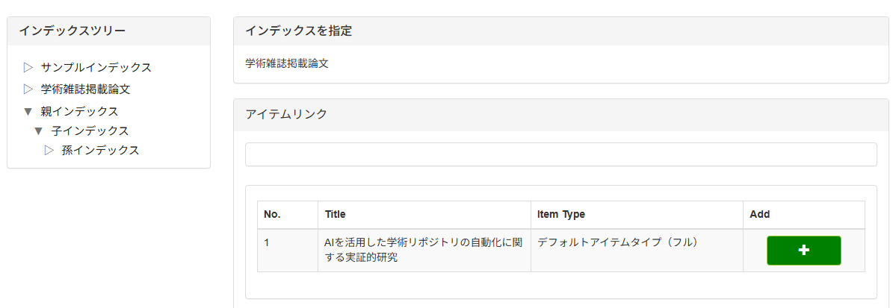

2. ［アイテムリンク］から対象アイテムの「+」ボタンをクリックします。  
［アイテムリンク］に選択したアイテムが表示されます。
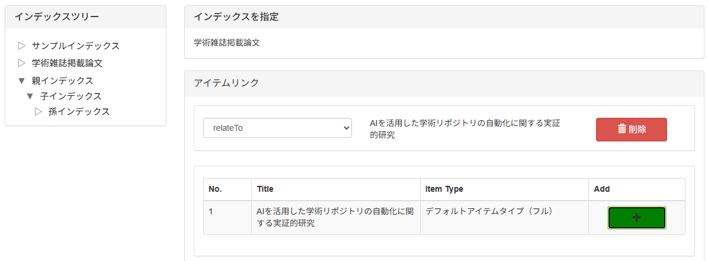

3. リレーションタイプのプルダウンから「isSupplementTo」を選択します。
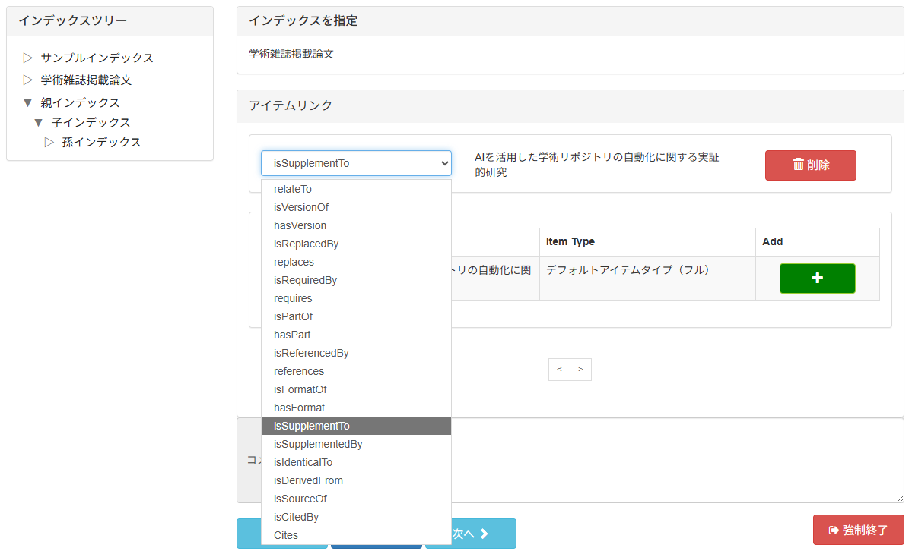

4. ［次へ］ボタンをクリックします。  
アイテム間リンクが登録されます。

#### 3.6.3 DOIの付与

自機関の識別子付与ルールに従って、JaLC DOI等のDOIを付与する機関では付与を行います。（handleなど他の識別子を利用している機関ではそちらでも可）

ただし、既に他のプラットフォームでDOIが付与されている場合は、DOIを付与しないようにしてください。

識別子の付与ができたら、［次へ］ボタンをクリックします。  
［戻る］ボタンをクリックすると、アイテム間リンクの画面に戻ることができます。

**DOI登録に関する注意事項（研究データ）**

DOIの登録には、DOI登録機関ごとに必須となるメタデータ項目があります。  
必須項目が満たされていない場合、DOI登録は行えません。  
詳細な項目や条件は、[「IRDBデータ提供機関のための DOI管理・メタデータ入力ガイドライン : JPCOARスキーマ ver2.0.x編」](https://jpcoar.repo.nii.ac.jp/records/2000282)を参照してください。

- **共通事項**
  - アイテムを登録するインデックスは公開状態であり、かつハーベスト公開が有効である必要があります。
  - ファイルが登録されていないアイテムはDOI登録できません。

- **JaLC DOI**  
  以下の項目が必須です。
  - **作成者姓名**
  - **出版者**: 不明な場合は「出版者不明」と入力してください。
  - **日付**: Issued / Created / Updated のいずれかが必須です。いずれも存在しない場合は、Issued: 9999-01-01を入力してください。

- **DataCite DOI**  
  以下の項目が必須です。
  - **作成者姓名**
  - **出版者**: 英語（en）での入力が推奨されています。
  - **日付**: Issued / Created / Updated のいずれかが必須です。いずれも存在しない場合は、Issued: 9999-01-01を入力してください。

### 3.7 アクティビティの承認

機関リポジトリ担当者がメタデータに不備がないか確認します。  
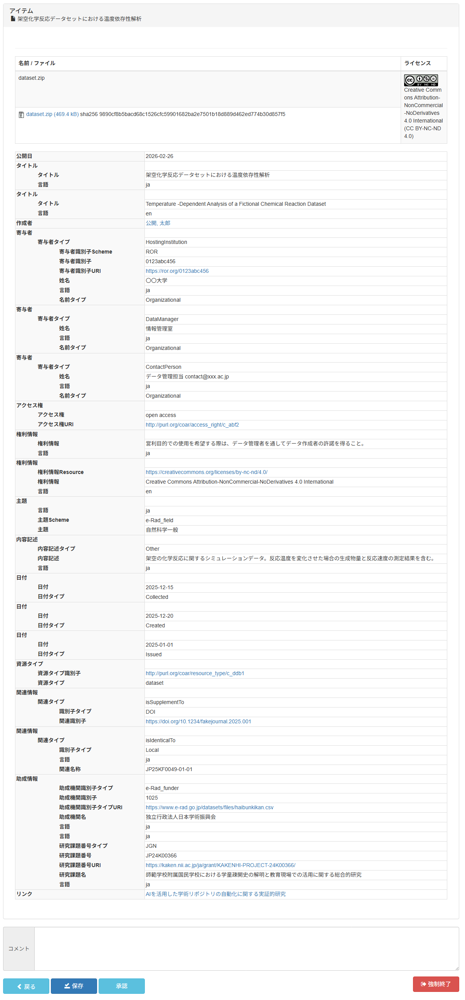
入力内容に問題がなければ［承認］ボタンをクリックします。  
不備があった場合、［戻る］ボタンを押すと１つ前のステップの画面に戻ることができます。  
承認後、ワークフロー完了画面が表示されます。

### 3.8 ワークフロー完了

機関リポジトリ担当者により承認されるとアイテム登録が完了します。
登録されたアイテムを確認するために［Access］ボタンをクリックします。

アイテム詳細画面が表示されます。

### 3.9 登録完了（登録見本）

登録されたアイテムの詳細ページを確認します。  
ファイルが正しく表示されているか、メタデータが正しく反映されているか、DOIや関連情報のリンクが正しく設定されているか等を確認します。
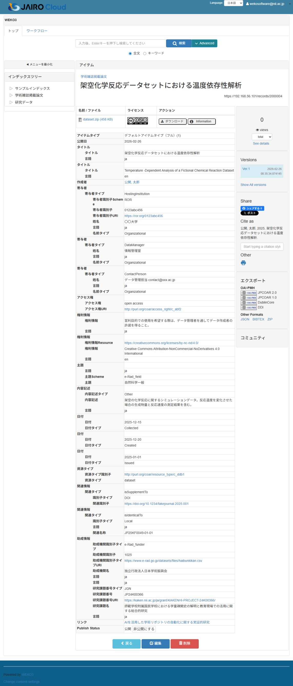

登録後にアイテムの修正が必要な場合は、［編集］ボタンをクリックすることで再編集が可能です。  
編集時の操作に関しては、[基本マニュアル個別登録編](https://jpcoar.org/support/jairo-cloud/manual/item-registration/#m4)もご参照ください。

### 3.10 ハーベスト結果の確認

IRDBによるコンテンツの収集（ハーベスト）が完了すると、登録された連絡先へ「ハーベスト処理結果通知メール」が届きます。  
メールの内容を確認し、エラーやワーニングの有無を確認して下さい。  

1. 通知メールの確認  
  メール本文に「レコードエラー件数」や「項目エラー件数」、「ワーニング件数」が記載されています。  
  レコードエラーの内容はメール本文で、項目エラー・ワーニングの詳細はIRDBのマイコンテンツから確認できます。  
    
  出典:「学術機関リポジトリデータベースサポート | マイコンテンツ・ユーザ情報」<https://support.irdb.nii.ac.jp/ja/harvest/usercontents>（参照日: 2026-01-28）

1. エラー詳細の取得と原因の特定
  詳細な原因を確認するため、学術機関リポジトリデータベース（IRDB）にログインします。  
  マイコンテンツ画面を開き、項目エラーとワーニングの詳細を確認します。  
  エラーメッセージの見方や修正方法については、以下の資料をご参照ください。
    - [エラーチェック解説 | 学術機関リポジトリデータベースサポート](https://support.irdb.nii.ac.jp/ja/harvest/jpcoar/validation)
    - [ハーベストエラー解消の手順（第4回学術コミュニケーションセミナー IRDB-カラクリと役割：どこから・どこへ・どのように-）](https://jpcoar.org/system/wp-content/uploads/2025/06/4-3_jpcoar_webinar_rev2.pdf)

## 4 GakuNin RDM-JAIRO Cloud連携を利用した場合の操作（概要）

GakuNin RDM–JAIRO Cloud連携を利用することで、論文ファイルおよび根拠データの登録とメタデータ入力をGakuNin RDM上で行い、その内容をJAIRO Cloudへ連携して登録できます。

本連携を利用した場合の登録の流れは、以下のとおりです。

1. GakuNin RDMで論文ファイル・根拠データを登録する
2. GakuNin RDMでメタデータを入力し、JAIRO Cloudへエクスポートする
3. JAIRO Cloudで登録アクティビティを再開し、登録を完了する

GakuNin RDMでの具体的な操作手順（画面操作や入力項目の詳細）については、[「Gakunin RDM-JAIRO Cloud連携を利用した場合の操作」](Gakunin%20RDM-JAIRO%20Cloud連携を利用した場合の操作.md)を参照してください。

JAIRO Cloud側の操作については、
本マニュアル内の[「JAIRO Cloudから登録する操作手順」](#jairo-cloudから登録する操作手順)に従ってください。

## 5 補足

### 5.1 CCライセンスの付与について

「ファイル情報[0].ライセンス」に入力しただけでは、アイコンが表示されるだけで、メタデータとして流通しません。必ず「権利情報」にも入力します。

（参照）[権利情報 | JPCOARスキーマガイドライン](https://schema.irdb.nii.ac.jp/ja/schema/1.0.2/7)

- CC BY 4.0の場合、以下のように選択または記入する。  
  - ファイル情報[0].ライセンス：Creative Commons Attribution 4.0 International (CC BY 4.0)  
  - 権利情報[0].権利情報Resource：<https://creativecommons.org/licenses/by/4.0/>  
  - 権利情報[0].権利情報：Creative Commons Attribution 4.0 International  
  - 権利情報[0].言語：en  

  入力例：
  

- CC BY-NC-ND 4.0の場合、以下のように選択または記入する。  
  - ファイル情報[0].ライセンス：Creative Commons Attribution-NonCommercial-NoDerivatives 4.0 International (CC BY-NC-ND 4.0)  
  - 権利情報[0].権利情報Resource：<https://creativecommons.org/licenses/by-nc-nd/4.0/>  
  - 権利情報[0].権利情報：Creative Commons Attribution-NonCommercial-NoDerivatives 4.0 International  
  - 権利情報[0].言語：en  

  入力例：
  
