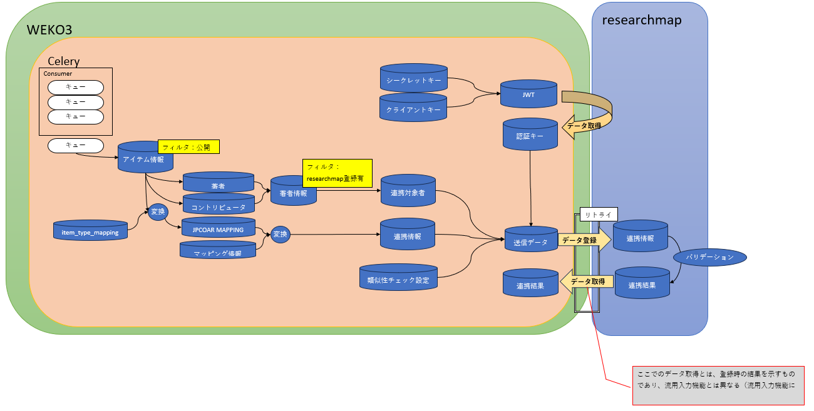

# researchmap連携機能

## 目的・用途

アイテム登録と同時にアイテムのメタデータをresearchmapの業績として登録する。

## 利用方法

## 利用可能なロール

| ロール   | システム管理者 | リポジトリ管理者 | コミュニティ管理者 | 登録ユーザー | 一般ユーザー | ゲスト(未ログイン) |
|:--------:|:--------------:|:----------------:|:------------------:|:------------:|:------------:|:-------------------:|
| 利用可否 | ○              | ○                | ○                  | ○            | ○            |                      |

## 機能内容

データの連携は以下の流れで行われる
    
    1. WEKO上でアイテム登録が完了すると同時に、Signalにデータ連携の予約がされる
    2. 予約キューがRabbitMQにエンキューされる
    3. 2.が完了した段階で連携結果のテーブル（cris_linkage_resultテーブル）のステータスを「実行中」にする
    4. celerybeatが設定されたタイミングでバッチを起動する
    5. キューから得た情報をもとに、データを取得・変換しデータ登録を行う

- キューは、１つのアイテム登録につき１つ存在する。
- データ連携は、一括反映が可能なため、著者はまとめて、アイテムごとに反映する。（10MB制限に留意する）
- WEKOでは１アイテム（＝業績情報）内に複数の著者を抱えているが、researchmapでは１著者に複数の業績情報を抱えている。そのため、１キューあたり、著者数ぶんの連携データを作成する。
- 送信対象の著者は、「コントリビュータ」「著者」欄のメタデータに、識別子スキーム「researchmap」で著者IDが登録されている人を対象とする。
- Researchmapに登録されている著者が連携対象。アイテムメタデータの nameIdentifier（nameIdentifierScheme="researchmap"）に値が存在する著者のみ連携する。
- 公開アイテムが連携対象。キューに登録されたアイテムでも、非公開ならば連携は行わない。（コンテンツファイルの公開状態は確認しない）
- 連携済みアイテムの業績IDはWEKO内のlinkage_itemsテーブルに保持する。アイテム更新時の再連携では、保持している業績IDをリクエストに含めることで、researchmap側で既存業績の更新として処理される。
- 再連携時にresearchmap側で対象業績が見つからない場合（404エラー）、linkage_itemsの該当レコードを削除済み状態（DELETED）に更新する。このとき、新規業績として登録するかどうかをユーザーがキュー投入時に選択できる（should_create_if_not_foundフラグ）。
- アイテム更新後に連携対象著者が変わった場合、メタデータから消えた著者のlinkage_itemsレコードをDELETED状態に更新し、再追加された著者のレコードはREGISTERED状態に戻す。
- researchmapから返却された業績IDが既に別アイテムのlinkage_itemsに存在する場合、重複とみなして新規レコードの作成をスキップし、その旨を連携結果メッセージに記録する。
- linkage_itemsのステータスは REGISTERED（R）と DELETED（D）の2値をとる。DELETED状態のレコードは連携送信の対象外となる。
- 連携結果をWEKO内の結果テーブルに書き戻す。（結果が出るまで待機する）
- リトライを行う。

## autofill機能（流用入力）による業績紐づけ情報の登録

アイテム登録・編集画面で、researchmapの既存業績データをWEKOのアイテムメタデータに自動入力し、使用した業績IDをlinkage_itemsに登録する機能。

### メタデータ自動入力の流れ

1. ユーザーが著者パーマリンク・業績種別・業績IDを入力し、Getボタンを押下する
2. `get_auto_fill_record_data`（`weko_items_autofill/views.py`）が呼び出される
3. `get_researchmapid_record_data`（`weko_items_autofill/utils.py`）がresearchmap APIからデータを取得する
4. 取得データを `WEKO_ITEMS_UI_CRIS_LINKAGE_RESEARCHMAP_MAPPINGS` に従いJPCOARマッピング形式に変換する
5. `WEKO_ITEMS_AUTOFILL_RESEARCHMAP_REQUIRED_ITEM` に定義されたフィールドのみフォームに自動入力される

- 入力パラメータ：著者パーマリンク・業績種別（`achievement_type`）・業績ID（`achievement_id`）・アイテムタイプID
- パーマリンクと業績IDはAPIコール前にバリデーションを行う（パーマリンク：英数字3〜20文字、業績ID：数字のみ）
- `enable_item_achievement_link` が有効な場合、指定した業績IDが既に他のWEKOアイテムのlinkage_itemsに存在するときは警告メッセージを返す

### 業績紐づけ情報の登録

autofillで使用した業績IDは、アイテム保存（ワークフロー完了）時に以下の条件をすべて満たす場合に `linkage_items` レコードとして自動登録される：

1. `enable_item_achievement_link` が有効であること
2. autofillで指定したパーマリンクがアイテムのメタデータ（nameIdentifierScheme="researchmap"）に存在すること
3. 同じパーマリンクがこのアイテムの `linkage_items` に未登録であること
4. 同じ業績IDがシステム内の他アイテムの `linkage_items` に未登録であること

### 紐づけパターン一覧

各列の意味：

- **連携済みID**：このアイテムの `linkage_items` に既に存在する業績ID（`-` は未連携）
- **autofill使用ID**：autofillで指定した業績ID
- **使用IDがWEKOにあるか**：autofill使用IDがWEKO内のいずれかのアイテムの `linkage_items` に存在するか
- **autofill後の変更**：autofill後にアイテムメタデータを変更したか
- **連携**：アイテム保存時にresearchmap連携（バッチ送信）を有効にしたか

> **注意**：連携済みIDが存在する場合（`-` 以外）、そのIDは必ずWEKO内の `linkage_items` に存在する。そのため、「連携済みIDあり かつ 使用IDがWEKOにあるか=FALSE」の組み合わせは論理的に発生しないため、以下の表には含めない。

| 連携済みID | autofill使用ID | 使用IDがWEKOにあるか | autofill後の変更 | 連携 | 結果（autofill→紐づけなし） | 結果（autofill→紐づけあり） |
|:---:|:---:|:---:|:---:|:---:|:---|:---|
| - | 1234 | TRUE | あり | TRUE | researchmapに作成。WEKO内で紐づけ保存 | 作成アイテムに1234を紐づけ。Autofill後に紐づけられないというワーニング表示 |
| - | 1234 | FALSE | あり | TRUE | researchmapに作成。WEKO内で紐づけ保存 | 作成アイテムに1234を紐づけ。1234を更新 |
| - | 1234 | TRUE | あり | FALSE | なにもなし | 作成アイテムに1234を紐づけ。Autofill後に紐づけられないというワーニング表示 |
| - | 1234 | FALSE | あり | FALSE | なにもなし | 作成アイテムに1234を紐づけ |
| - | 1234 | TRUE | なし | TRUE | マージモードにより異なる。merge: エラー / similar: 1234にマージの可能性大。WEKO内業績ID重複のため保存失敗（ログ出力） / force: 1234でない業績を作成し紐づけ保存 | 作成アイテムに1234を紐づけ。Autofill後に紐づけられないというワーニング表示。その後マージモードにより異なる。merge: エラー / similar: 1234にマージの可能性大。WEKO内業績ID重複のため保存失敗（ログ出力） / force: 1234でない業績を作成し紐づけ保存 |
| - | 1234 | FALSE | なし | TRUE | マージモードにより異なる。merge: エラー / similar: 1234にマージの可能性大。1234と紐づけ / force: 1234でない業績を作成し紐づけ保存 | マージモードにより異なる。merge: エラー / similar: 1234にマージの可能性大。1234と紐づけ / force: 1234でない業績を作成し紐づけ保存 |
| - | 1234 | TRUE | なし | FALSE | なにもなし | 作成アイテムに1234を紐づけ。Autofill後に紐づけられないというワーニング表示 |
| - | 1234 | FALSE | なし | FALSE | なにもなし | 作成アイテムに1234を紐づけ |
| 1234 | 1234 | TRUE | あり | TRUE | 1234を更新。ID紐づけに変更なし | 1234を更新。ID紐づけに変更なし |
| 1234 | 1234 | TRUE | あり | FALSE | なにもなし | ID紐づけに変更なし（すでに紐づけ済み） |
| 1234 | 1234 | TRUE | なし | TRUE | 1234を更新。ID紐づけに変更なし | 1234を更新。アイテムに1234を紐づけようとするが、すでに紐づけ済みなので変化なし |
| 1234 | 1234 | TRUE | なし | FALSE | なにもなし | アイテムに1234を紐づけようとするが、すでに紐づけ済みなので変化なし |
| 1234 | 5678 | TRUE | あり | TRUE | 紐づいている1234の業績が5678+変更で更新。紐づくIDは1234のまま | 紐づいている1234の業績が5678+変更で更新。紐づくIDは1234のまま |
| 1234 | 5678 | TRUE | あり | FALSE | なにもなし | アイテムに1234を紐づけようとするが、すでに紐づけ済みなので変化なし |
| 1234 | 5678 | TRUE | なし | TRUE | 紐づいている1234の業績が5678の内容で更新。紐づくIDは1234のまま | 紐づいている1234の業績が5678の内容で更新。紐づくIDは1234のまま |
| 1234 | 5678 | TRUE | なし | FALSE | なにもなし | アイテムに1234を紐づけようとするが、すでに紐づけ済みなので変化なし |

## モジュール一覧

|No|ファイルパス|モジュール名|説明|
|---|---|---|---|
|1|weko_admin/admin.py|save_keys|シークレットキーとクライアントキーの保存する|
|2||save_merge_mode|マージモードの変更を保存する|
|3|weko_authors/models.py|get_authorIdInfo|機関名と著者IDから著者情報を取得する|
|4|weko_items_autofill/utils.py|get_researchmap_autofill_item|変換可能なJPCORE MAPPINGをアイテムタイプから取得|
|5|	|get_researchmapid_record_data|researchmapからデータを取得し、JPCOARMAPPING変換可能な形式に整形し、自動入力共通メソッドを呼び出す。|
|6|weko_items_autofill/views.py|get_auto_fill_record_data|Getボタン押下時に呼び出される取得アクション|
|7|weko_items_ui/linkage.py|create_access_token|認証キーの作成する|
|8||create_jwt|シークレットキーとクライアントキーからJWTを作成する|
|9||retry|指定された回数リトライを行う|
|10|weko_items_ui/models.py|CRISLinkageResult.register_linkage_result|連携結果を取得し、DBに保存する|
|11||CRISLinkageResult.set_running|連携結果を実行中とする|
|12||LinkageItems.create|業績IDと著者パーマリンクをlinkage_itemsテーブルに保存する|
|13||LinkageItems.get_items_by_permalink_itemid|アイテムIDと著者パーマリンクで連携済み業績IDを取得する（REGISTERED状態のみ）|
|14||LinkageItems.get_by_item_id|アイテムIDで全ステータスの連携レコードを取得する|
|15||LinkageItems.get_by_external_item_id|業績IDで連携レコードを取得し重複チェックに使用する|
|16||LinkageItems.update_status|連携レコードのステータスをREGISTERED/DELETEDに更新する|
|17|weko_items_ui/signals.py|receiver|RabbitMQにキューを入れる|
|18|weko_items_ui/tasks.py|bulk_post_item_to_researchmap|RabbitMQからキューを取得する|
|19||process_researchmap_queue|researchmapに送信に必要な情報を取得し、データを送信する|
|20||update_linkage_by_authors|著者変更に応じてlinkage_itemsのステータスを更新する|
|21||get_item|uuidからアイテムを取得する|
|22||is_public|アイテムの公開情報を取得する|
|23||get_authors|アイテムのメタデータから連携対象の著者情報を取得する|
|24||get_merge_mode|マージモードを取得する|
|25||get_achievement_type|業績種別を取得する|
|26||build_achievement|業績種別ごとのJSONを作成する|
|27||build_one_data|著者1人分のデータを作成する|
|28||sync_item_to_researchmap|業績データをresearchmapに送信し連携結果とlinkage_itemsを更新する|

## 設定値

|設定値名|説明|ファイルパス|デフォルト値|
|---|---|---|---|
|WEKO_ADMIN_SETTINGS_RESEARCHMAP_LINKAGE_SETTINGS|admin_settingsテーブルのreseachmap関連のデータが入るカラム名	|weko_admin/config.py|researchmap_linkage_settings|
|WEKO_ADMIN_SETTINGS_RESEARCHMAP_MERGE_MODES|管理画面で選択できるマージモードの種類|weko_admin/config.py|\[('similar_merge_similar_data','similar merge(similar data priority)'),('similar_merge_input_data','similar merge(input data priority)'),('merge','merge'),('force','force')\]|
|WEKO_ADMIN_CRIS_LINKAGE_SETTINGS_TEMPLATE|CRIS連携用HTMLのパス|weko_admin/config.py|weko_admin/admin/cris_linkage_setting.html|
|WEKO_ITEMS_AUTOFILL_RESEARCHMAP_REQUIRED_ITEM|流用入力機能で自動入力可能なJPCOARマッピングの項目一覧|weko_items_autofill/config.py|\["title","creator","contributor","subject","description","publisher","date","language","type","version","identifier","relation","sourceIdentifier","sourceTitle","volume","issue","numPages","pageStart","pageEnd","conference"\]|
|WEKO_ITEMS_UI_CRIS_LINKAGE_RESEARCHMAP_BASE_URL|researchmapのURL|scripts/instance.cfg|https://api-trial.researchmap.jp|
|WEKO_ITEMS_UI_CRIS_LINKAGE_RESEARCHMAP_HOST|researchmapのhostURL|scripts/instance.cfg|api-trial.researchmap.jp:443|
|WEKO_ITEMS_UI_CRIS_LINKAGE_RESEARCHMAP_RETRY_MAX|リトライ回数の上限|weko_items_ui/config.py|5|
|WEKO_ITEMS_UI_CRIS_LINKAGE_RESEARCHMAP_MERGE_MODE_DEFAULT|マージモードの初期設定値|weko_items_ui/config.py|similar_merge_similar_data|
|WEKO_ITEMS_UI_DEFAULT_LANG|言語未選択の際に、設定される言語|weko_items_ui/config.py|ja|
|WEKO_ITEMS_UI_CRIS_LINKAGE_RESEARCHMAP_MAPPINGS|researchmapとJPCOARの対応表|weko_items_ui/config.py|\[{ 'type'	:	'lang' ,	'rm_name'	:	'paper_title' ,	'jpcoar_name' 	:	'dc:title' ,	'weko_name'	:	'title'	},{ 'type'	:	'lang' ,	'rm_name'	:	'description' ,	'jpcoar_name' 	:	'datacite:description' ,	'weko_name'	:	'description'	},{ 'type'	:	'lang' ,	'rm_name'	:	'publisher' ,	'jpcoar_name' 	:	'dc:publisher' ,	'weko_name'	:	'publisher'	},{ 'type'	:	'lang' ,	'rm_name'	:	'publication_name' ,	'jpcoar_name' 	:	'jpcoar:sourceTitle' ,	'weko_name'	:	'sourceTitle'	},{ 'type'	:	'authors' ,	'rm_name'	:	'authors' ,	'jpcoar_name' 	:	'jpcoar:creator' ,	'weko_name'	:	'creator'	},{ 'type'	:	'identifiers' ,	'rm_name'	:	'identifiers' ,	'jpcoar_name' 	:	'jpcoar:relation' ,	'weko_name'	:	'relation'	},{ 'type'	:	'simple_value' ,	'rm_name'	:	'publication_date' ,	'jpcoar_name' 	:	'datacite:date' ,	'weko_name'	:	'date'	},{ 'type'	:	'simple' ,	'rm_name'	:	'volume' ,	'jpcoar_name' 	:	'jpcoar:volume' ,	'weko_name'	:	'volume'	},{ 'type'	:	'simple' ,	'rm_name'	:	'number' ,	'jpcoar_name' 	:	'jpcoar:issue' ,	'weko_name'	:	'issue'	},{ 'type'	:	'simple' ,	'rm_name'	:	'starting_page' ,	'jpcoar_name' 	:	'jpcoar:pageStart' ,	'weko_name'	:	'pageStart'	},{ 'type'	:	'simple' ,	'rm_name'	:	'ending_page' ,	'jpcoar_name' 	:	'jpcoar:pageEnd' ,	'weko_name'	:	'pageEnd'	},{ 'type'	:	'simple' ,	'rm_name'	:	'language' ,	'jpcoar_name' 	:	'dc:language' ,	'weko_name'	:	'language'	},{ 'type'	:	'type' ,	'rm_name'	:	'published_paper_type' ,	'jpcoar_name' 	:	'dc:type' ,	'weko_name'	:	'type'	},{ 'type'	:	'type' ,	'rm_name'	:	'misc_type' ,	'jpcoar_name' 	:	'dc:type' ,	'weko_name'	:	'type'	},{ 'type'	:	'type' ,	'rm_name'	:	'book_type' ,	'jpcoar_name' 	:	'dc:type' ,	'weko_name'	:	'type'	},{ 'type'	:	'type' ,	'rm_name'	:	'presentation_type' ,	'jpcoar_name' 	:	'dc:type' ,	'weko_name'	:	'type'	},{ 'type'	:	'type' ,	'rm_name'	:	'work_type' ,	'jpcoar_name' 	:	'dc:type' ,	'weko_name'	:	'type'	},{ 'type'	:	'type' ,	'rm_name'	:	'dataset_type' ,	'jpcoar_name' 	:	'dc:type' ,	'weko_name'	:	'type'	} \]|
|WEKO_ITEMS_UI_CRIS_LINKAGE_RESEARCHMAP_TYPE_MAPPINGS|researchmapのtypeとJPCOARの資源タイプの対応表|weko_items_ui/config.py|\[{ 'achievement_type'	:	'published_papers' ,	'detail_type_name'	:	' ' ,	'JPCOAR_resource_type'	:	'article'	},{ 'achievement_type'	:	'published_papers' ,	'detail_type_name'	:	'scientific_journal' ,	'JPCOAR_resource_type'	:	'journal article'	},{ 'achievement_type'	:	'published_papers' ,	'detail_type_name'	:	'international_conference_proceedings' ,	'JPCOAR_resource_type'	:	'conference paper'	},{ 'achievement_type'	:	'published_papers' ,	'detail_type_name'	:	'research_institution' ,	'JPCOAR_resource_type'	:	'departmental bulletin paper'	},{ 'achievement_type'	:	'published_papers' ,	'detail_type_name'	:	'symposium' ,	'JPCOAR_resource_type'	:	'conference paper'	},{ 'achievement_type'	:	'published_papers' ,	'detail_type_name'	:	' research_society' ,	'JPCOAR_resource_type'	:	'article'	},{ 'achievement_type'	:	'published_papers' ,	'detail_type_name'	:	'in_book' ,	'JPCOAR_resource_type'	:	'article'	},{ 'achievement_type'	:	'published_papers' ,	'detail_type_name'	:	'master_thesis',	'JPCOAR_resource_type'	:	'master thesis'	},{ 'achievement_type'	:	'published_papers' ,	'detail_type_name'	:	'others' ,	'JPCOAR_resource_type'	:	'article'	},{ 'achievement_type'	:	'published_papers' ,	'detail_type_name'	:	'doctoral_thesis' ,	'JPCOAR_resource_type'	:	'doctoral thesis'	},{ 'achievement_type'	:	'misc' ,	'detail_type_name'	:	' ' ,	'JPCOAR_resource_type'	:	'other'	},{ 'achievement_type'	:	'misc' ,	'detail_type_name'	:	'report_scientific_journal' ,	'JPCOAR_resource_type'	:	'other'	},{ 'achievement_type'	:	'misc' ,	'detail_type_name'	:	'report_research_institution' ,	'JPCOAR_resource_type'	:	'other'	},{ 'achievement_type'	:	'misc' ,	'detail_type_name'	:	'summary_international_conference' ,	'JPCOAR_resource_type'	:	'other'	},{ 'achievement_type'	:	'misc' ,	'detail_type_name'	:	'summary_national_conference' ,	'JPCOAR_resource_type'	:	'other'	},{ 'achievement_type'	:	'misc' ,	'detail_type_name'	:	'technical_report' ,	'JPCOAR_resource_type'	:	'technical report'	},{ 'achievement_type'	:	'misc' ,	'detail_type_name'	:	'introduction_scientific_journal' ,	'JPCOAR_resource_type'	:	'other'	},{ 'achievement_type'	:	'misc' ,	'detail_type_name'	:	'introduction_international_proceedings' ,	'JPCOAR_resource_type'	:	'other'	},{ 'achievement_type'	:	'misc' ,	'detail_type_name'	:	'introduction_commerce_magazine' ,	'JPCOAR_resource_type'	:	'other'	},{ 'achievement_type'	:	'misc' ,	'detail_type_name'	:	'introduction_other' ,	'JPCOAR_resource_type'	:	'other'	},{ 'achievement_type'	:	'misc' ,	'detail_type_name'	:	'lecture_materials' ,	'JPCOAR_resource_type'	:	'learning object'	},{ 'achievement_type'	:	'misc' ,	'detail_type_name'	:	'book_review' ,	'JPCOAR_resource_type'	:	'other'	},{ 'achievement_type'	:	'misc' ,	'detail_type_name'	:	'meeting_report' ,	'JPCOAR_resource_type'	:	'other'	},{ 'achievement_type'	:	'misc' ,	'detail_type_name'	:	'others' ,	'JPCOAR_resource_type'	:	'other'	},{ 'achievement_type'	:	'book_etc' ,	'detail_type_name'	:	' ' ,	'JPCOAR_resource_type'	:	'book'	},{ 'achievement_type'	:	'book_etc' ,	'detail_type_name'	:	'scholarly_book' ,	'JPCOAR_resource_type'	:	'book'	},{ 'achievement_type'	:	'book_etc' ,	'detail_type_name'	:	'dictionary_or_encycropedia' ,	'JPCOAR_resource_type'	:	'book'	},{ 'achievement_type'	:	'book_etc' ,	'detail_type_name'	:	'textbook' ,	'JPCOAR_resource_type'	:	'book'	},{ 'achievement_type'	:	'book_etc' ,	'detail_type_name'	:	'report' ,	'JPCOAR_resource_type'	:	'report'	},{ 'achievement_type'	:	'book_etc' ,	'detail_type_name'	:	'general_book' ,	'JPCOAR_resource_type'	:	'book'	},{ 'achievement_type'	:	'book_etc' ,	'detail_type_name'	:	'musical_material' ,	'JPCOAR_resource_type'	:	'musical notation'	},{ 'achievement_type'	:	'book_etc' ,	'detail_type_name'	:	'film_or_video' ,	'JPCOAR_resource_type'	:	'video'	},{ 'achievement_type'	:	'book_etc' ,	'detail_type_name'	:	'image_material' ,	'JPCOAR_resource_type'	:	'image'	},{ 'achievement_type'	:	'book_etc' ,	'detail_type_name'	:	'phonetic_material' ,	'JPCOAR_resource_type'	:	'sound'	},{ 'achievement_type'	:	'book_etc' ,	'detail_type_name'	:	'map' ,	'JPCOAR_resource_type'	:	'map'	},{ 'achievement_type'	:	'book_etc' ,	'detail_type_name'	:	'others' ,	'JPCOAR_resource_type'	:	'other'	},{ 'achievement_type'	:	'presentations' ,	'detail_type_name'	:	' ' ,	'JPCOAR_resource_type'	:	'conference presentation'	},{ 'achievement_type'	:	'presentations' ,	'detail_type_name'	:	'oral_presentation' ,	'JPCOAR_resource_type'	:	'conference presentation'	},{ 'achievement_type'	:	'presentations' ,	'detail_type_name'	:	'invited_oral_presentation' ,	'JPCOAR_resource_type'	:	'conference presentation'	},{ 'achievement_type'	:	'presentations' ,	'detail_type_name'	:	'keynote_oral_presentation' ,	'JPCOAR_resource_type'	:	'conference presentation'	},{ 'achievement_type'	:	'presentations' ,	'detail_type_name'	:	'poster_presentation' ,	'JPCOAR_resource_type'	:	'conference poster'	},{ 'achievement_type'	:	'presentations' ,	'detail_type_name'	:	'public_symposium' ,	'JPCOAR_resource_type'	:	'other'	},{ 'achievement_type'	:	'presentations' ,	'detail_type_name'	:	'nominated_symposium' ,	'JPCOAR_resource_type'	:	'other'	},{ 'achievement_type'	:	'presentations' ,	'detail_type_name'	:	'public_discourse' ,	'JPCOAR_resource_type'	:	'other'	},{ 'achievement_type'	:	'presentations' ,	'detail_type_name'	:	'media_report' ,	'JPCOAR_resource_type'	:	'other'	},{ 'achievement_type'	:	'presentations' ,	'detail_type_name'	:	'others' ,	'JPCOAR_resource_type'	:	'other'	},{ 'achievement_type'	:	'works' ,	'detail_type_name'	:	' ' ,	'JPCOAR_resource_type'	:	'other'	},{ 'achievement_type'	:	'works' ,	'detail_type_name'	:	'artistic_activity' ,	'JPCOAR_resource_type'	:	'other'	},{ 'achievement_type'	:	'works' ,	'detail_type_name'	:	'architecural_works' ,	'JPCOAR_resource_type'	:	'other'	},{ 'achievement_type'	:	'works' ,	'detail_type_name'	:	'software' ,	'JPCOAR_resource_type'	:	'software'	},{ 'achievement_type'	:	'works' ,	'detail_type_name'	:	'database' ,	'JPCOAR_resource_type'	:	'other'	},{ 'achievement_type'	:	'works' ,	'detail_type_name'	:	'web_service' ,	'JPCOAR_resource_type'	:	'interactive resource'	}{ 'achievement_type'	:	'works' ,	'detail_type_name'	:	'educational_materials' ,	'JPCOAR_resource_type'	:	'other'	},{ 'achievement_type'	:	'works' ,	'detail_type_name'	:	'others' ,	'JPCOAR_resource_type'	:	'other'	},{ 'achievement_type'	:	'others' ,	'detail_type_name'	:	'works' ,	'JPCOAR_resource_type'	:	,'other'	}\]|
|LINKAGE_MQ_EXCHANGE|RabbitMQのExchangeの設定値|scripts/instance.cfg|Exchange('cris_researchmap_linkage', type='direct')|
|LINKAGE_MQ_QUEUE|RabbitMQのQueueの設定値|scripts/instance.cfg|Queue("cris_researchmap_linkage", exchange=LINKAGE_MQ_EXCHANGE, routing_key="cris_researchmap_linkage",queue_arguments={"x-queue-type":"quorum"})|
|CELERY_BEAT_SCHEDULE|バッチを起動するタイミングについての設定値|scripts/instance.cfg|bulk_post_item_to_researchmap': {'task': 'weko_items_ui.tasks.bulk_post_item_to_researchmap','schedule': crontab(hour=0, minute=0),'args': [],  }|

## 実装補足（v2.0.2 実装との突き合わせ）

- 実装補足：JWT生成関数は `create_jwt`（`weko_items_ui.linkage`）。BASE_URL/HOST の既定は `https://api-trial.researchmap.jp` / `api-trial.researchmap.jp:443`。連携結果モデルは `CRISLinkageResult`（table `cris_linkage_result`）。アイテムと業績の紐づけ情報は `LinkageItems` (table `linkage_items`)。連携タスクの beat は `crontab(hour=0, minute=0)`。config は `WEKO_ITEMS_UI_CRIS_LINKAGE_RESEARCHMAP_*`（weko-items-ui）。

## 更新履歴

|日付|GitHubコミットID|更新内容|
|---|---|---|
|||初版作成|
|2026-07-31|7ba798e2c4600622e093159ca1a989ff3899709b|連携済み業績IDの保持と更新時の挙動、autofill機能による業績紐づけ情報の登録について追記|
